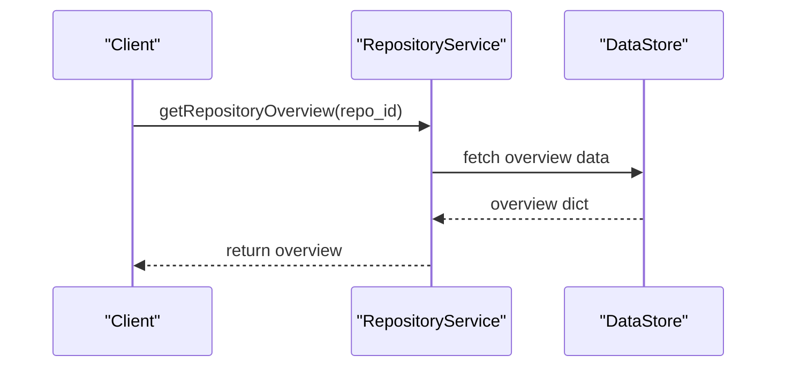
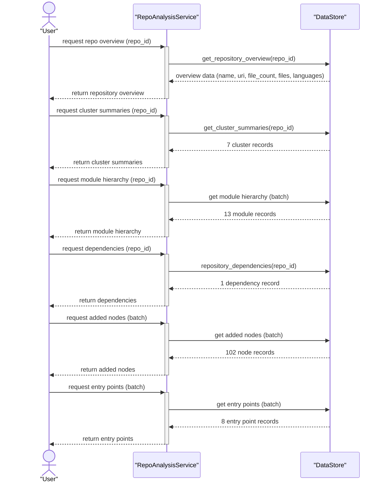

# petclinic-customers-service

## project_overview

The **petclinic-customers-service** is a Spring Boot microservice responsible for managing owner and pet data within the PetClinic application. It provides a RESTful API for CRUD operations on owners and pets, persists data via Spring Data JPA, and registers with a Eureka service discovery server.

This service is part of the PetClinic microservices architecture and interacts with other services, such as the API gateway (`petclinic-api-gateway`), which routes external requests to this service's owner and pet endpoints. For architectural details including package structure and Spring Boot configuration, see the [Architecture Guide](ARCHITECTURE.md).

### API Endpoints

The service exposes two primary REST controllers: `OwnerResource` (mapped to `/owners`) and `PetResource` (handles pet and pet-type management).

#### Owner Endpoints

**Base path:** `/owners`

- **Create Owner**
  - Method: `POST /owners`
  - Creates a new owner record. Returns the created `Owner` entity with HTTP `201 Created`.
  - Request Body: `OwnerRequest` record (fields: `firstName`, `lastName`, `address`, `city`, `telephone`; all `@NotBlank`, and `telephone` also `@Digits(integer=12, fraction=0)`).
  - Response: `Owner` entity (e.g., `{"id":1,"firstName":"George","lastName":"Franklin","address":"110 W. Liberty St.","city":"Madison","telephone":"6085551023"}`).

- **Find Owner by ID**
  - Method: `GET /owners/{ownerId}`
  - Retrieves a single owner by their ID. The `ownerId` path variable must be ≥ 1.
  - Response: `Owner` entity (wrapped in `Optional`).

- **Find All Owners**
  - Method: `GET /owners`
  - Returns a list of all owner records.
  - Response: `List<Owner>`.

- **Update Owner**
  - Method: `PUT /owners/{ownerId}`
  - Updates an existing owner. Returns HTTP `204 No Content` on success. Throws `ResourceNotFoundException` (HTTP 404) if the owner is not found.
  - Path Parameter: `ownerId` — must be ≥ 1.
  - Request Body: `OwnerRequest` record (same schema as Create).

#### Pet Endpoints

The `PetResource` controller handles the following endpoints:

- **Get Pet Types**
  - Method: `GET /petTypes`
  - Returns a list of all available pet types (`PetType` entities).
  - Response: `List<PetType>`.

- **Create Pet**
  - Method: `POST /owners/{ownerId}/pets`
  - Creates a new pet and associates it with the specified owner. Returns HTTP `201 Created` with the created `Pet` entity. Throws `ResourceNotFoundException` (HTTP 404) if the owner is not found.
  - Path Parameter: `ownerId` — must be ≥ 1.
  - Request Body: `PetRequest` record.

- **Find Pet**
  - Method: `GET /owners/*/pets/{petId}`
  - Retrieves pet details by pet ID. Returns a `PetDetails` DTO containing the pet information.
  - Path Parameter: `petId` — the ID of the pet to retrieve.
  - Response: `PetDetails`.

- **Update Pet**
  - Method: `PUT /owners/*/pets/{petId}`
  - Updates an existing pet record. Returns HTTP `204 No Content` on success.
  - Path Parameter: `petId` — extracted from the request body.
  - Request Body: `PetRequest` record.

### Data Models

The domain model is organized in the `model` package:

- **Entities**
  - `Owner`: JPA entity with fields: `id`, `firstName`, `lastName`, `address`, `city`, `telephone`. Has a one-to-many relationship with `Pet`.
  - `Pet`: JPA entity with fields: `id`, `name`, `birthDate`. Has a many-to-one relationship with `Owner` and a relationship to `PetType`.
  - `PetType`: JPA entity with fields: `id` and `name`, representing the category of a pet (e.g., cat, dog, lizard).

- **Data Transfer Objects (DTOs)**
  - `OwnerRequest` (package: `web`): Record for owner create/update request validation.
  - `PetRequest` (package: `web`): Record for pet create/update request bodies.
  - `PetDetails` (package: `web`): DTO for pet details response.

- **Repositories**
  - `OwnerRepository`: `JpaRepository<Owner, Integer>` — provides standard CRUD operations.
  - `PetRepository`: Spring Data JPA interface — includes `findPetTypes()` query method.

### Error Handling

The `ResourceNotFoundException` class (in the `web` package) is a custom exception annotated with HTTP 404 status. It is thrown by controllers when a requested owner or pet does not exist.

### Mappers

The `Mapper<T, U>` interface (in `web/mapper`) defines a generic mapping contract between request and entity types. `OwnerEntityMapper` implements this interface to convert `OwnerRequest` objects into `Owner` entities.





### Additional Documentation

- [Customers Service Architecture Guide](ARCHITECTURE.md) — Covers the layered package structure (`web`, `model`, `config`), Spring Boot configuration, service discovery integration, and the `MetricConfig` class for monitoring setup.

## development

### Prerequisites

- Java (Spring Boot compatible version)
- Maven
- A running MySQL instance (or HSQLDB for local development)

### Building the Project

```bash
# Build the service using Maven
mvn clean package

# Build with the Docker profile
mvn clean package -PbuildDocker
```

### Running Locally

```bash
# Run the Spring Boot application
mvn spring-boot:run
```

The application registers with a Eureka discovery server upon startup via the `@EnableDiscoveryClient` annotation on `CustomersServiceApplication`.

### Running Tests

```bash
# Run all tests
mvn test

# Run a specific test class
mvn test -Dtest=PetResourceTest
```

### Dependencies

Key dependencies from `pom.xml`:

| Dependency | Purpose |
|---|---|
| `spring-boot-starter-webmvc` | REST API framework |
| `spring-boot-starter-data-jpa` | Database persistence |
| `spring-boot-starter-actuator` | Health checks and metrics endpoints |
| `spring-cloud-starter-netflix-eureka-client` | Service discovery registration |
| `spring-cloud-starter-config` | Externalized configuration |
| `micrometer-registry-prometheus` | Prometheus metrics export |
| `mysql-connector-j` | MySQL database driver (runtime) |
| `hsqldb` | In-memory database for testing (runtime) |
| `spring-boot-starter-test` | Testing support (test scope) |
| `spring-boot-starter-webmvc-test` | Web MVC test support (test scope) |