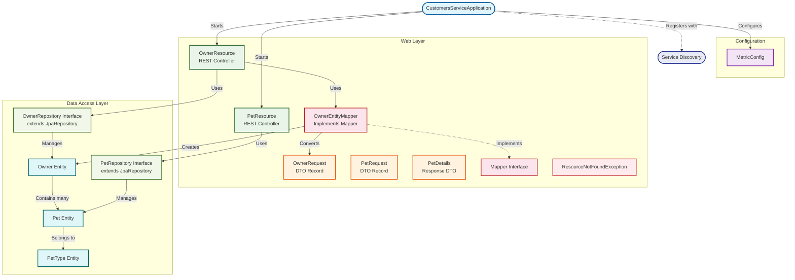
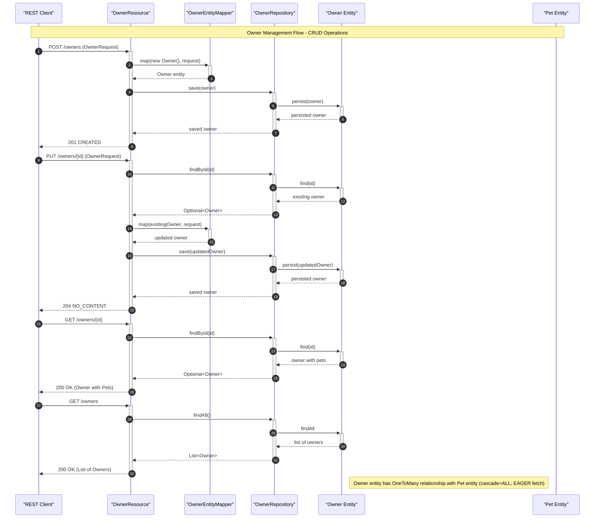
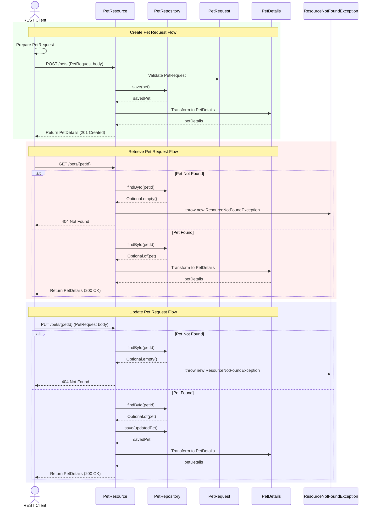

# REST API Reference and Data Models


REST API endpoints and domain data models for the PetClinic Customers Service — a Spring Boot microservice responsible for managing owners, pets, and pet type information.

## Overview

The PetClinic Customers Service provides the customer-facing data layer of the Pet Clinic application. It exposes RESTful endpoints for CRUD operations on **Owner** and **Pet** resources, backed by JPA entities persisted to a relational database. The service handles owner registration, pet enrollment, and pet type lookups.

The codebase is organized into three primary packages:

- **`model`** — JPA entities (`Owner`, `Pet`, `PetType`) and Spring Data repositories (`OwnerRepository`, `PetRepository`)
- **`web`** — REST controllers (`OwnerResource`, `PetResource`), request DTOs (`OwnerRequest`, `PetRequest`), response DTOs (`PetDetails`), and exception handling (`ResourceNotFoundException`)
- **`web/mapper`** — Object mapping between request DTOs and entity objects (`Mapper` interface, `OwnerEntityMapper`)
- **`config`** — Application configuration including Micrometer metrics (`MetricConfig`)



## Features

- **Owner management** — Create, retrieve, update, and list owner records through dedicated REST endpoints under `/owners`
- **Pet management** — Create and update pets associated with an owner, and retrieve individual pet details via endpoints under `/owners/{ownerId}/pets`
- **Pet type lookup** — Retrieve the list of available pet types from the `/petTypes` endpoint
- **Request validation** — Input DTOs (`OwnerRequest`, `PetRequest`) are validated with Jakarta Bean Validation constraints (e.g., `@NotBlank`, `@Min`, `@Digits`)
- **Standardized error handling** — `ResourceNotFoundException` provides consistent HTTP 404 responses when requested resources do not exist
- **Metrics and observability** — Micrometer integration with Prometheus registry, common tags, and `@Timed` aspect support for controller-level metrics
- **Service discovery** — Eureka client registration via Spring Cloud for integration with the broader microservices ecosystem
- **Distributed tracing** — Spring Cloud Sleuth / Zipkin support for request tracing across services

## Requirements

- **Java** 17 or higher
- **Maven** 3.6+
- A relational database (MySQL for production; HSQLDB available for local development)
- Network access to a Eureka discovery server (for service registration in a microservices deployment)

## Installation

```bash
# Clone the repository
git clone https://github.com/audoclyphia-evals/petclinic-customers-service.git
cd petclinic-customers-service

# Build the project
mvn clean package

# Run the service (default port 8081)
mvn spring-boot:run
```

To build without running tests:

```bash
mvn clean package -DskipTests
```

To build the Docker image (requires the `buildDocker` profile):

```bash
mvn clean package -PbuildDocker
```

## Quick Start

1. Ensure Java 17+ and Maven are installed.
2. Build and start the service:

```bash
mvn spring-boot:run
```

3. Verify the service is running by requesting all owners:

```bash
curl http://localhost:8081/owners
```

Expected output (empty list if no data exists):

```json
[]
```

4. Create a new owner:

```bash
curl -X POST http://localhost:8081/owners \
  -H "Content-Type: application/json" \
  -d '{
    "firstName": "Jane",
    "lastName": "Doe",
    "address": "123 Main St",
    "city": "Springfield",
    "telephone": "5551234567"
  }'
```

Expected output (returns the created owner with an assigned ID):

```json
{
  "id": 1,
  "firstName": "Jane",
  "lastName": "Doe",
  "address": "123 Main St",
  "city": "Springfield",
  "telephone": "5551234567",
  "pets": []
}
```

## Usage

### Owner Endpoints

The `OwnerResource` controller manages all owner operations under the `/owners` base path. The controller class is annotated with `@Timed("petclinic.owner")` for Micrometer metrics collection.



#### Create an Owner

```
POST /owners
```

Creates a new owner record. Returns the persisted owner with an auto-generated ID.

**Request body:** `OwnerRequest` (validated)

**Response:** `201 Created` — `Owner`

```bash
curl -X POST http://localhost:8081/owners \
  -H "Content-Type: application/json" \
  -d '{
    "firstName": "John",
    "lastName": "Smith",
    "address": "456 Oak Ave",
    "city": "Madison",
    "telephone": "5559876543"
  }'
```

#### Retrieve All Owners

```
GET /owners
```

Returns a list of all owner records.

**Response:** `200 OK` — `List<Owner>`

```bash
curl http://localhost:8081/owners
```

#### Retrieve a Single Owner

```
GET /owners/{ownerId}
```

Returns a single owner by ID. The `ownerId` path variable must be greater than or equal to 1.

**Response:** `200 OK` — `Owner` | `404 Not Found`

```bash
curl http://localhost:8081/owners/1
```

#### Update an Owner

```
PUT /owners/{ownerId}
```

Updates an existing owner. If the owner is not found, a `ResourceNotFoundException` is thrown, resulting in a 404 response.

**Request body:** `OwnerRequest` (validated)

**Response:** `204 No Content` | `404 Not Found`

```bash
curl -X PUT http://localhost:8081/owners/1 \
  -H "Content-Type: application/json" \
  -d '{
    "firstName": "John",
    "lastName": "Smith-Jones",
    "address": "789 Elm Blvd",
    "city": "Madison",
    "telephone": "5551112222"
  }'
```

### Pet Endpoints

The `PetResource` controller handles pet-related operations. It manages pet creation and updates within the context of an owner, and provides pet type lookups.



#### Retrieve Pet Types

```
GET /petTypes
```

Returns the list of all available pet types (e.g., cat, dog, lizard).

**Response:** `200 OK` — `List<PetType>`

```bash
curl http://localhost:8081/petTypes
```

#### Create a Pet for an Owner

```
POST /owners/{ownerId}/pets
```

Creates a new pet and associates it with the specified owner. If the owner does not exist, a `ResourceNotFoundException` is returned.

**Request body:** `PetRequest` (validated)

**Response:** `201 Created` — `Pet` | `404 Not Found`

```bash
curl -X POST http://localhost:8081/owners/1/pets \
  -H "Content-Type: application/json" \
  -d '{
    "name": "Buddy",
    "birthDate": "2023-06-15",
    "type": { "id": 1 }
  }'
```

#### Retrieve Pet Details

```
GET /owners/*/pets/{petId}
```

Returns the detailed view of a pet. The `*` wildcard indicates that the owner ID is not used for lookup — the pet is retrieved directly by its own ID. The response uses the `PetDetails` record, which presents a formatted view of the pet entity.

**Response:** `200 OK` — `PetDetails`

```bash
curl http://localhost:8081/owners/1/pets/1
```

#### Update a Pet

```
PUT /owners/*/pets/{petId}
```

Updates an existing pet's information. The pet ID is derived from the request body.

**Request body:** `PetRequest` (validated)

**Response:** `204 No Content`

```bash
curl -X PUT http://localhost:8081/owners/1/pets/1 \
  -H "Content-Type: application/json" \
  -d '{
    "id": 1,
    "name": "Buddy Jr.",
    "birthDate": "2023-06-15",
    "type": { "id": 2 }
  }'
```

### Error Handling

The `ResourceNotFoundException` class is a `RuntimeException` annotated to produce HTTP 404 responses. It is thrown by both `OwnerResource` and `PetResource` when a requested owner or pet cannot be found.

```java
// Thrown when an owner is not found
throw new ResourceNotFoundException("Owner " + ownerId + " not found");
```

### Data Models

| Entity | Table | Key Fields |
|--------|-------|------------|
| `Owner` | `owners` | `id`, `firstName`, `lastName`, `address`, `city`, `telephone` |
| `Pet` | (mapped by JPA) | `id`, `name`, `birthDate`, `owner` (relationship) |
| `PetType` | (mapped by JPA) | `id`, `name` |

The `Owner` entity maintains a `@OneToMany` relationship with `Pet`, eagerly fetched and cascade-enabled. Pets are sorted alphabetically by name when accessed via `Owner.getPets()`.