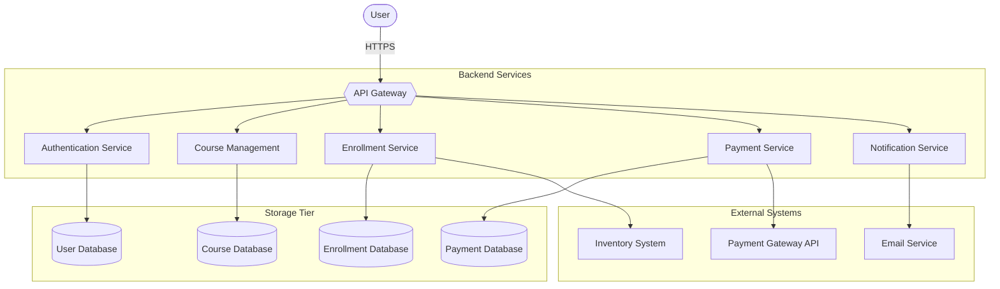
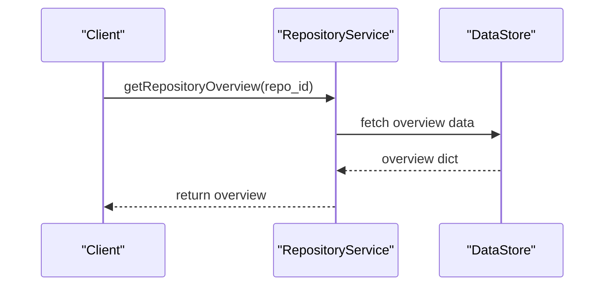
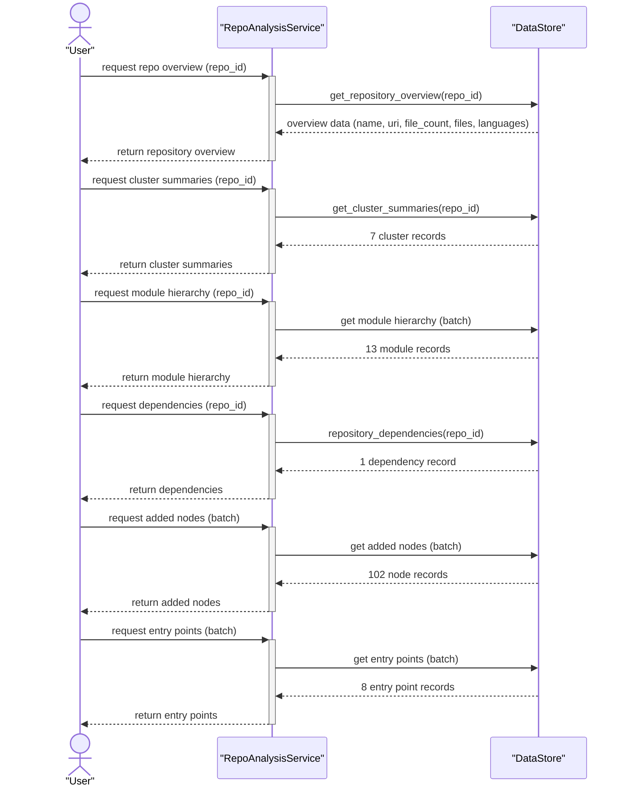

# Customers Service Architecture Guide

## architecture

The **Customers Service** (`petclinic-customers-service`) is a Java Spring Boot microservice that manages owner and pet domain data for the PetClinic application. It exposes RESTful endpoints for owner and pet CRUD operations, uses JPA entities for persistence through Spring Data JPA, and registers with a service discovery system (Eureka) for integration with other microservices. This service is part of the broader PetClinic microservices architecture and is primarily called by the [petclinic-api-gateway](../petclinic-api-gateway) service. It manages two core domain concepts:

- **Owners** — individuals who have pets, with contact information (name, address, telephone)
- **Pets** — animals associated with owners, categorized by pet type

### High-Level Design

The Customers Service follows a layered architecture with three main concerns:

- **Web layer** — REST controllers that handle HTTP requests, validation, and response mapping
- **Model layer** — JPA entities and Spring Data JPA repository interfaces for persistence
- **Configuration layer** — application configuration for metrics and monitoring

The service is designed as a standalone microservice that registers with a service discovery server (Eureka) and exposes HTTP APIs on port 8081 (configured via `docker.image.exposed.port` in `pom.xml`). It is called by the API gateway for owner and pet operations.



### Key Components

The service is organized into the following component groups:

| Component | Type | Responsibility |
|-----------|------|---------------|
| `CustomersServiceApplication` | Entry point | Spring Boot main class with `@EnableDiscoveryClient` for service discovery |
| `OwnerResource` | REST Controller | Handles CRUD operations for the `/owners` endpoint |
| `PetResource` | REST Controller | Handles pet-related endpoints including `/petTypes` and `/owners/{ownerId}/pets` |
| `Owner` | JPA Entity | Domain model for owners with fields: id, firstName, lastName, address, city, telephone; one-to-many relationship to `Pet` |
| `Pet` | JPA Entity | Domain model for pets with fields: id, name, birthDate, type; many-to-one relationship to `Owner` |
| `PetType` | JPA Entity | Domain model representing pet categories with id and name |
| `OwnerRepository` | Repository Interface | Spring Data JPA repository extending `JpaRepository<Owner, Integer>` |
| `PetRepository` | Repository Interface | Spring Data JPA repository for Pet and PetType data access |
| `OwnerRequest` | DTO (record) | Validates owner creation/update requests with fields: firstName, lastName, address, city, telephone |
| `PetRequest` | DTO | Request body for pet creation and update operations |
| `PetDetails` | DTO | Response DTO for pet detail requests |
| `OwnerEntityMapper` | Mapper | Implements `Mapper` interface; maps `OwnerRequest` to `Owner` entity |
| `Mapper` | Interface | Generic mapper contract for converting between request and entity types |
| `ResourceNotFoundException` | Exception | Custom exception annotated with HTTP 404 status for missing resources |
| `MetricConfig` | Configuration | Sets up common metric tags and a `TimedAspect` bean for monitoring |

### Component Interactions

The following sequence diagrams illustrate the request flows for owner and pet management:





The general interaction pattern is:

```
┌──────────────┐      ┌───────────────────┐      ┌──────────────────┐
│  API Gateway │ ───▶ │  REST Controller  │ ───▶ │   Repository     │ ───▶ Database
│              │      │  (OwnerResource /  │      │ (OwnerRepository  │
│              │      │   PetResource)     │      │  PetRepository)   │
└──────────────┘      └───────────────────┘      └──────────────────┘
```

1. The API gateway (`petclinic-api-gateway`) forwards HTTP requests to the appropriate controller.
2. Controllers (`OwnerResource`, `PetResource`) parse request DTOs, validate input, and apply mapping via `OwnerEntityMapper`.
3. Controllers delegate persistence operations to repository interfaces (`OwnerRepository`, `PetRepository`).
4. Responses are returned as JPA entities or DTOs (`PetDetails`) back through the controller.

### Data Flow

**Owner Management**

- `POST /owners` — Creates a new owner. Accepts an `OwnerRequest` body. The `OwnerEntityMapper` maps the request to an `Owner` entity, which is persisted via `OwnerRepository.save()`.
- `GET /owners` — Returns all owners from `OwnerRepository.findAll()`.
- `GET /owners/{ownerId}` — Retrieves a single owner by ID via `OwnerRepository.findById()`.
- `PUT /owners/{ownerId}` — Updates an existing owner. Looks up the owner by ID (throws `ResourceNotFoundException` if not found), maps the updated `OwnerRequest` onto the existing entity, and saves.

**Pet Management**

- `GET /petTypes` — Returns all available pet types from `PetRepository.findPetTypes()`.
- `POST /owners/{ownerId}/pets` — Creates a new pet for an owner. Looks up the owner (throws `ResourceNotFoundException` if not found), associates the pet with the owner, and persists via the save helper.
- `PUT /owners/*/pets/{petId}` — Updates an existing pet. Looks up the pet by ID, applies the `PetRequest` data, and saves.
- `GET owners/*/pets/{petId}` — Retrieves a pet by ID, returning a `PetDetails` DTO.

### Design Decisions

**Spring Data JPA**: Repositories (`OwnerRepository`, `PetRepository`) extend `JpaRepository`, providing standard CRUD operations without manual query implementation.

**JPA Entity Relationships**: `Owner` has a one-to-many relationship with `Pet`. `Pet` has a many-to-one relationship with `Owner`. `PetType` is a separate entity referenced by `Pet`.

**DTO/Record Pattern**: `OwnerRequest` is a Java `record` with Jakarta Validation constraints (`@NotBlank`, `@Digits`). `PetRequest` and `PetDetails` serve as request/response DTOs.

**Mapper Pattern**: The `Mapper` interface provides a generic contract for converting between request DTOs and entities. `OwnerEntityMapper` implements this for `OwnerRequest` to `Owner` mapping.

**Service Discovery**: The application uses `@EnableDiscoveryClient` to register with Eureka, enabling service-to-service communication within the microservices architecture.

**Exception Handling**: `ResourceNotFoundException` is used for 404 responses when an owner or pet is not found, providing structured error information.

### Testing

The service includes test classes for validating pet endpoints. `PetResourceTest` covers the `PetResource` controller operations.

### Metrics and Monitoring

The `MetricConfig` class configures:
- Common tags applied to all metrics (application name: `petclinic`)
- A `TimedAspect` bean for method-level timing metrics

The service depends on `spring-boot-starter-actuator`, `micrometer-registry-prometheus`, and `spring-boot-starter-zipkin` as declared in `pom.xml`.

## project_structure

### Project Structure

```
petclinic-customers-service/
├── pom.xml                                          # Maven build configuration
└── src/
    ├── main/java/org/springframework/samples/petclinic/customers/
    │   ├── CustomersServiceApplication.java        # Spring Boot entry point with service discovery
    │   ├── config/
    │   │   └── MetricConfig.java                   # Metrics configuration (common tags, timed aspect)
    │   ├── model/
    │   │   ├── Owner.java                          # JPA entity: owner (id, name, address, telephone)
    │   │   ├── OwnerRepository.java                # Spring Data JPA repository for Owner
    │   │   ├── Pet.java                            # JPA entity: pet (id, name, birthDate, type)
    │   │   ├── PetRepository.java                  # Spring Data JPA repository for Pet and PetType
    │   │   └── PetType.java                        # JPA entity: pet category (id, name)
    │   └── web/
    │       ├── OwnerRequest.java                   # DTO record for owner request validation
    │       ├── OwnerResource.java                  # REST controller: CRUD operations for /owners
    │       ├── PetDetails.java                     # DTO for pet details response
    │       ├── PetRequest.java                     # DTO for pet creation/update request body
    │       ├── PetResource.java                    # REST controller: pet and pet type endpoints
    │       ├── ResourceNotFoundException.java      # Custom exception for HTTP 404 responses
    │       └── mapper/
    │           ├── Mapper.java                     # Generic mapper interface for entity conversion
    │           └── OwnerEntityMapper.java          # OwnerRequest → Owner entity mapper implementation
    └── test/java/org/springframework/samples/petclinic/customers/
        └── web/
            └── PetResourceTest.java                # Test class for PetResource endpoints
```

### Key Packages

- **`customers`** — Root package containing the Spring Boot application class
- **`config`** — Application configuration classes (metrics, monitoring)
- **`model`** — JPA entities (`Owner`, `Pet`, `PetType`) and Spring Data repositories
- **`web`** — REST controllers (`OwnerResource`, `PetResource`), DTOs (`OwnerRequest`, `PetRequest`, `PetDetails`), error handling (`ResourceNotFoundException`), and entity mappers
- **`web/mapper`** — Mapper interface and implementations for converting between DTOs and entities

### Dependencies (from `pom.xml`)

The service uses the following key dependencies:

| Dependency | Purpose |
|-----------|---------|
| `spring-boot-starter-data-jpa` | JPA persistence with Spring Data |
| `spring-boot-starter-webmvc` | Spring MVC web framework |
| `spring-boot-starter-actuator` | Monitoring and management endpoints |
| `spring-cloud-starter-config` | Spring Cloud configuration management |
| `spring-cloud-starter-netflix-eureka-client` | Service discovery (Eureka) |
| `mysql-connector-j` | MySQL database driver |
| `hsqldb` | In-memory database |
| `micrometer-registry-prometheus` | Prometheus metrics export |
| `chaos-monkey-spring-boot` | Chaos engineering support |
| `jolokia-core` | JMX monitoring |
| `spring-boot-starter-zipkin` | Distributed tracing support |
| `junit-jupiter` / `assertj-core` | Testing frameworks |