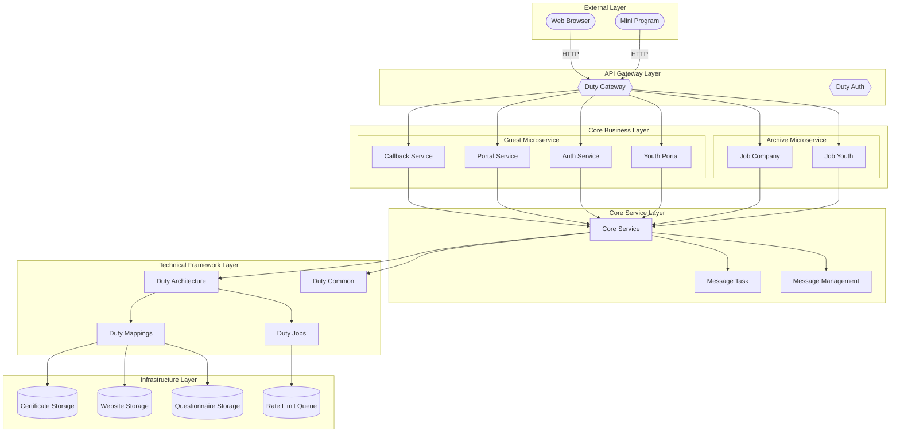
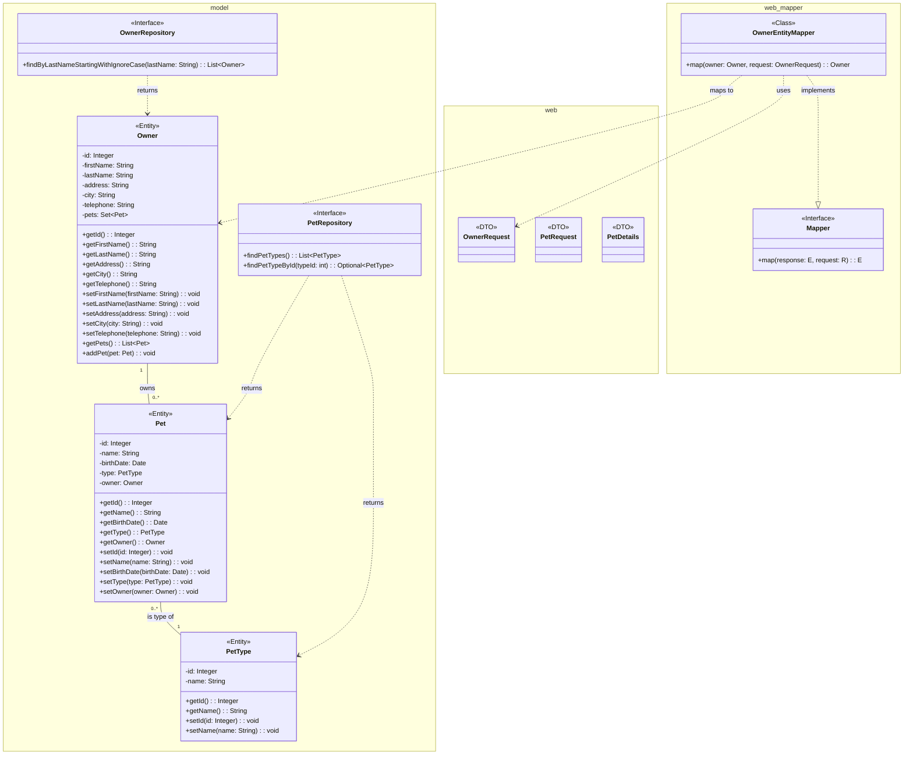
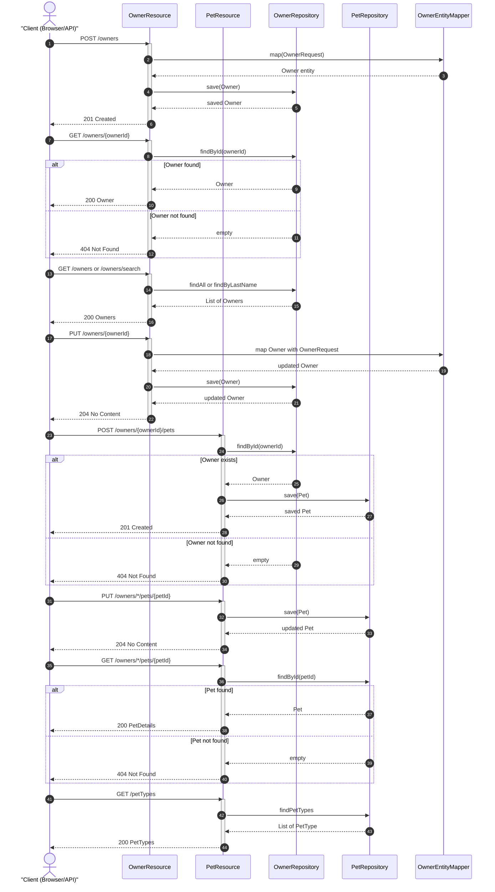

# Architecture Overview

REST API layer for managing Owner and Pet resources within the Spring PetClinic microservices system.

The `petclinic-customers-service` is a Spring Boot microservice responsible for the customer domain — creating, reading, updating, and searching Owner records, as well as managing Pets associated with those owners. It exposes a REST API, integrates with Spring Cloud service discovery (Eureka), and provides Micrometer-based observability for production monitoring.

## Architecture

The service follows a standard layered Spring Boot architecture with clear separation between the web (controller) layer, the data access (repository) layer, and the domain model.

### Component Overview

| Layer | Components | Responsibility |
|-------|-----------|----------------|
| **Web** | `OwnerResource`, `PetResource` | HTTP endpoints for CRUD operations on Owners and Pets |
| **Mapping** | `OwnerEntityMapper`, `Mapper<T,R>` | Conversion between DTO request objects and JPA entities |
| **Model** | `Owner`, `Pet`, `PetType` | JPA entity definitions and domain logic |
| **Data Access** | `OwnerRepository`, `PetRepository` | Spring Data JPA interfaces for database operations |
| **Config** | `MetricConfig`, `CustomersServiceApplication` | Application bootstrap, service discovery, and Micrometer metrics setup |
| **Exception Handling** | `ResourceNotFoundException` | Standardized 404 responses for missing resources |

### Data Flow

REST requests enter through `OwnerResource` or `PetResource`, which delegate to the appropriate repository for persistence. Request payloads are mapped to entities via `OwnerEntityMapper` (implementing the generic `Mapper` interface). The `Owner` entity maintains a bidirectional one-to-many relationship with `Pet`, meaning pet data is eagerly loaded through its owning owner.

API request and response DTOs (`OwnerRequest`, `PetRequest`, `PetDetails`) decouple the external API contract from internal entity structure, allowing the persistence model to evolve independently.

### Key Design Decisions

- **Spring Data JPA repositories** — `OwnerRepository` and `PetRepository` extend `JpaRepository`, inheriting standard CRUD operations with zero boilerplate. Custom queries (e.g., `findByLastNameStartingWithIgnoreCase`) follow Spring Data naming conventions.
- **DTO separation** — `OwnerRequest` and `PetRequest` records serve as inbound DTOs, while `PetDetails` serves as an outbound view model for pet information. This prevents entity classes from leaking into the API contract.
- **Generic mapper interface** — The `Mapper<T,R>` interface with `OwnerEntityMapper` implementation provides a consistent pattern for request-to-entity conversion.
- **Metrics integration** — `MetricConfig` registers a common `"application"` tag on all metrics and enables `@Timed` aspect support, which the controllers use (e.g., `@Timed("petclinic.owner")`).
- **Service discovery** — `CustomersServiceApplication` enables a Eureka discovery client, allowing the service to register itself and be discovered by other microservices in the PetClinic system.

### System Architecture

<!-- diagram_key: architecture_system_architecture -->


### Domain Model and DTOs

The entity model centers on `Owner` and `Pet`, with `PetType` as a reference entity. The DTO layer provides clean request/response boundaries.

<!-- diagram_key: class_domain_model_and_dtos -->


### Request Lifecycle

The following sequence diagram illustrates the complete CRUD flows for both Owner and Pet resources, showing the interaction between controllers, mappers, repositories, and the database.

<!-- diagram_key: sequence_owner_and_pet_crud_flows -->


## Project Structure

```
src/
├── main/
│   └── java/
│       └── org/springframework/samples/petclinic/customers/
│           ├── CustomersServiceApplication.java   # Spring Boot entry point with Eureka discovery
│           ├── config/
│           │   └── MetricConfig.java              # Micrometer metrics configuration
│           ├── model/
│           │   ├── Owner.java                     # Owner entity (JPA)
│           │   ├── OwnerRepository.java           # Spring Data repository for Owner
│           │   ├── Pet.java                       # Pet entity (JPA)
│           │   ├── PetRepository.java             # Spring Data repository for Pet
│           │   └── PetType.java                   # PetType reference entity
│           └── web/
│               ├── OwnerResource.java             # REST controller for /owners endpoints
│               ├── PetResource.java               # REST controller for /pets endpoints
│               ├── OwnerRequest.java              # Inbound DTO for Owner create/update
│               ├── PetRequest.java                # Inbound DTO for Pet create/update
│               ├── PetDetails.java                # Outbound view model for Pet responses
│               ├── ResourceNotFoundException.java # 404 exception handling
│               └── mapper/
│                   ├── Mapper.java                # Generic mapper interface
│                   └── OwnerEntityMapper.java     # OwnerRequest → Owner mapper
└── test/
    └── java/
        └── org/springframework/samples/petclinic/customers/
            └── web/
                └── PetResourceTest.java           # Unit tests for PetResource
```

### Key Packages

- **`config`** — Application configuration classes. `MetricConfig` sets up Micrometer common tags and the `TimedAspect` bean for method-level timing.
- **`model`** — JPA entities and Spring Data repository interfaces. `Owner` manages the one-to-many relationship with `Pet` via `addPet()` and sorted `getPets()`.
- **`web`** — REST controllers, DTOs, and the mapper sub-package. Controllers are annotated with `@RestController` and `@Timed` for metrics. The `ResourceNotFoundException` is annotated to produce HTTP 404 responses.
- **`web/mapper`** — The `Mapper<T,R>` interface defines a generic `map(target, source)` contract, implemented by `OwnerEntityMapper` for Owner DTO conversion.