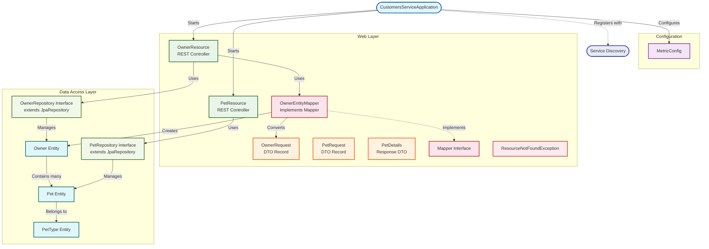
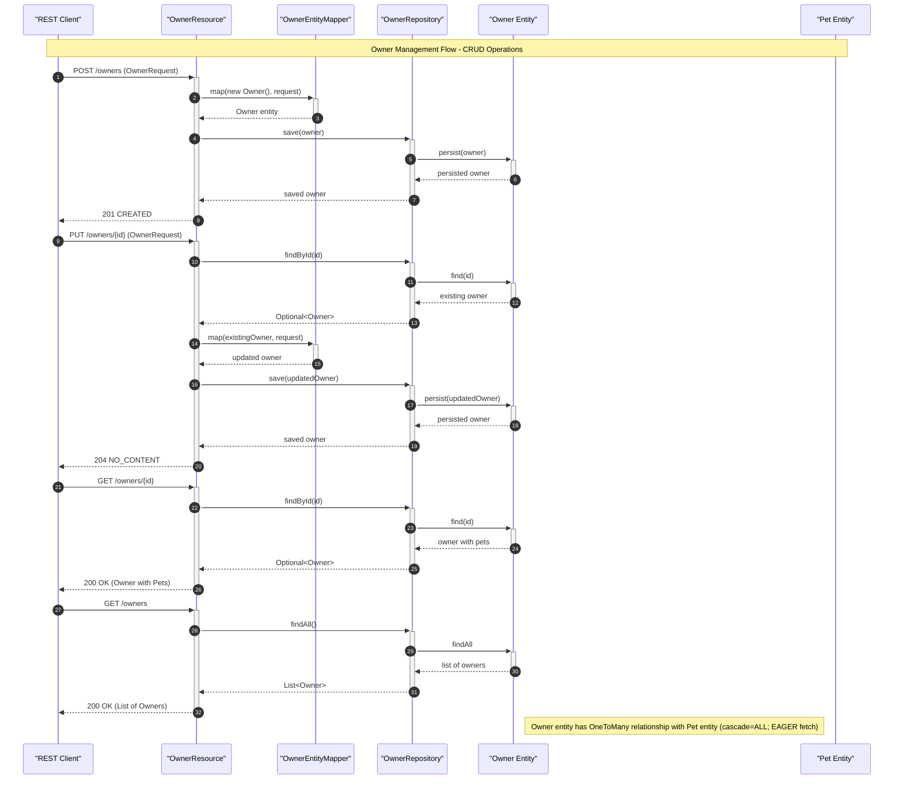
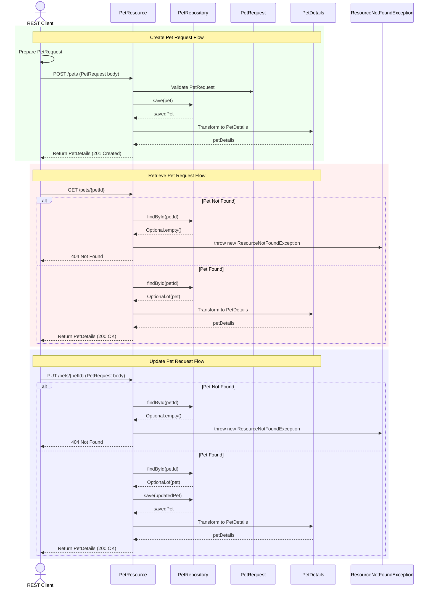

# Customers Service Architecture Guide


Microservice providing owner and pet management capabilities for the PetClinic application.

The Customers Service is a Spring Boot microservice that manages owner and pet data within the PetClinic ecosystem. It exposes RESTful APIs for creating, retrieving, and updating owner and pet records, backed by JPA persistence. The service registers with Netflix Eureka for discovery and is routed to through the API gateway.

## Overview

This document covers the internal architecture of the `petclinic-customers-service`, a Java-based Spring Boot microservice. The service owns the domain models for owners and pets, provides REST controllers for HTTP access, and persists data through Spring Data JPA repositories.

The service participates in a larger microservices architecture where the API gateway (`petclinic-api-gateway`) routes inbound HTTP traffic to the owner and pet endpoints defined here. The service registers itself with a Netflix Eureka discovery server and uses Spring Cloud Config for externalized configuration.

### Main Components

| Package | Purpose |
|---|---|
| `config` | Application configuration, including Micrometer metrics setup |
| `model` | JPA entity classes (`Owner`, `Pet`, `PetType`) and repository interfaces |
| `web` | REST controllers, DTOs, exception handling, and entity mappers |
| `web/mapper` | Generic mapper interface and owner-specific implementation for DTO-to-entity conversion |

## Features

- **Owner CRUD operations** — Create, read, and update owner records through REST endpoints under `/owners`
- **Pet management** — Create, retrieve, and update pets associated with owners via `/owners/{ownerId}/pets`
- **Pet type catalog** — Query available pet types through `/petTypes`
- **Service discovery** — Registers with Netflix Eureka for dynamic service lookup by the API gateway
- **Centralized configuration** — Uses Spring Cloud Config for externalized property management
- **Metrics and monitoring** — Exposes Micrometer metrics with a Prometheus registry, including common application tags and timed aspect support for controller methods
- **Distributed tracing** — Integrates with Zipkin via Spring Boot starter for request tracing
- **Standardized error handling** — Custom `ResourceNotFoundException` maps missing resources to HTTP 404 responses

## Requirements

- Java 17 or higher
- Maven 3.9+
- A running MySQL instance (production) or HSQLDB (default/test configuration)
- A Netflix Eureka server for service discovery
- A Spring Cloud Config server for externalized configuration (optional)

### Optional Tools

- Docker (for containerized builds via the `buildDocker` Maven profile)
- Prometheus (for metrics scraping)
- Zipkin (for distributed trace collection)

## Installation

Clone the repository and build with Maven:

```bash
git clone https://github.com/audoclyphia-evals/petclinic-customers-service.git
cd petclinic-customers-service
mvn clean install
```

To build a Docker image:

```bash
mvn package -PbuildDocker
```

## Quick Start

1. Start the application with the default HSQLDB profile:

```bash
mvn spring-boot:run
```

2. Verify the service is running by fetching all owners:

```bash
curl http://localhost:8081/owners
```

3. Create a new owner:

```bash
curl -X POST http://localhost:8081/owners \
  -H "Content-Type: application/json" \
  -d '{"firstName":"John","lastName":"Doe","address":"123 Main St","city":"Springfield","telephone":"5551234567"}'
```

Expected response (HTTP 201):

```json
{
  "id": 1,
  "firstName": "John",
  "lastName": "Doe",
  "address": "123 Main St",
  "city": "Springfield",
  "telephone": "5551234567"
}
```

## Architecture



The service follows a standard layered Spring Boot architecture with three primary packages:

- **`model`** contains JPA entities (`Owner`, `Pet`, `PetType`) and Spring Data repository interfaces (`OwnerRepository`, `PetRepository`) that handle persistence.
- **`web`** exposes REST controllers (`OwnerResource`, `PetResource`), request DTOs (`OwnerRequest`, `PetRequest`), a response record (`PetDetails`), and a custom exception class (`ResourceNotFoundException`).
- **`config`** provides the `MetricConfig` class for Micrometer metrics setup.

The `OwnerEntityMapper` class, located in `web/mapper`, implements a generic `Mapper` interface and is responsible for translating `OwnerRequest` DTOs into `Owner` entity objects.

### Owner Management Flow



The `OwnerResource` controller is mapped to `/owners` and annotated with `@Timed("petclinic.owner")` for method-level metrics collection. It accepts an `OwnerRepository` and `OwnerEntityMapper` through constructor injection. Create and update operations validate input through the `@Valid` annotation on the `OwnerRequest` body. The update endpoint returns HTTP 204 (No Content) on success, while creation returns HTTP 201 (Created) with the saved entity.

### Pet Management Flow



The `PetResource` controller manages pet operations. Pet creation associates a new pet with an existing owner (looked up via `OwnerRepository`), while pet updates and retrieval operate directly on the `PetRepository`. The `PetDetails` record provides a view-model representation of pet data for API responses.

## API Endpoints

### Owner Endpoints

| Method | Path | Description |
|---|---|---|
| `POST` | `/owners` | Create a new owner |
| `GET` | `/owners` | List all owners |
| `GET` | `/owners/{ownerId}` | Retrieve an owner by ID |
| `PUT` | `/owners/{ownerId}` | Update an existing owner |

### Pet Endpoints

| Method | Path | Description |
|---|---|---|
| `GET` | `/petTypes` | List all available pet types |
| `POST` | `/owners/{ownerId}/pets` | Create a new pet for an owner |
| `GET` | `/owners/*/pets/{petId}` | Retrieve a specific pet's details |
| `PUT` | `/owners/*/pets/{petId}` | Update an existing pet's details |

### Data Transfer Objects

**`OwnerRequest`** — Used for both creation and update of owners:

```java
record OwnerRequest(
    String firstName,
    String lastName,
    String address,
    String city,
    String telephone
) {}
```

**`PetRequest`** — Used for creation and update of pets:

```java
record PetRequest(
    int id,
    String name,
    LocalDate birthDate,
    int typeId
) {}
```

**`PetDetails`** — Response record wrapping a `Pet` entity for API output.

## Domain Model

### Owner

The `Owner` entity maps to the `owners` table and is annotated with `@Entity` and `@Table(name = "owners")`. Key properties:

| Field | Column | Constraints |
|---|---|---|
| `id` | `id` | `@Id`, auto-generated |
| `firstName` | `first_name` | `@NotBlank` |
| `lastName` | `last_name` | `@NotBlank` |
| `address` | `address` | `@NotBlank` |
| `city` | `city` | `@NotBlank` |
| `telephone` | `telephone` | `@NotBlank`, `@Digits(fraction=0, integer=12)` |

An `Owner` has a one-to-many relationship with `Pet` (`@OneToMany(cascade = CascadeType.ALL, fetch = FetchType.EAGER, mappedBy = "owner")`). The `addPet` method manages both sides of the association. The `getPets` method returns pets sorted by name.

### Pet

The `Pet` entity represents an individual pet, linked to an `Owner` and a `PetType`. It is persisted through `PetRepository`, which extends `JpaRepository<Pet, Integer>`.

### PetType

The `PetType` entity represents a category of pet (e.g., cat, dog). Pet types are retrieved via `PetRepository.findPetTypes()`.

## Exception Handling

`ResourceNotFoundException` extends `RuntimeException` and is annotated to produce HTTP 404 responses. It is thrown in controller methods when an owner or pet cannot be found by ID:

```java
throw new ResourceNotFoundException("Owner " + ownerId + " not found");
```

## Monitoring

The `MetricConfig` class configures Micrometer metrics:

```java
@Configuration
public class MetricConfig {

    @Bean
    MeterRegistryCustomizer<@NonNull MeterRegistry> metricsCommonTags() {
        return registry -> registry.config().commonTags("application", "petclinic");
    }

    @Bean
    TimedAspect timedAspect(MeterRegistry registry) {
        return new TimedAspect(registry);
    }
}
```

The `metricsCommonTags` bean applies an `application=petclinic` tag to all metrics. The `timedAspect` bean enables `@Timed` annotation support on controller methods. The `prometheus` registry is included for metrics export.