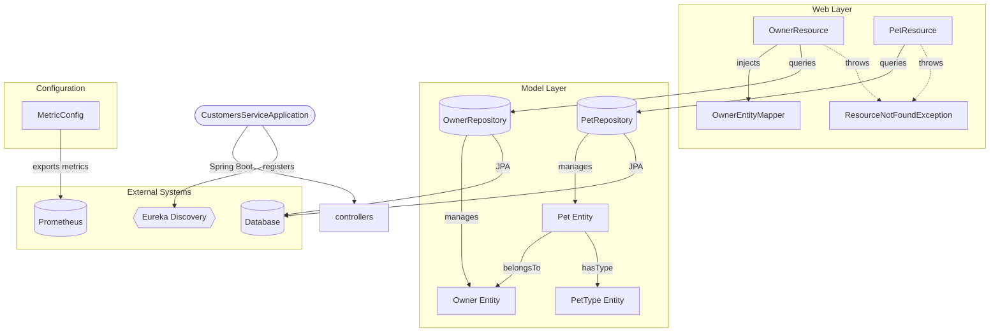

# Architecture Overview

**REST API microservice managing pet owners and their pets for the PetClinic application.**

The PetClinic Customers Service is a Spring Boot microservice that provides CRUD operations for owners and pets. It exposes REST endpoints for creating, updating, and retrieving owner and pet data, backed by JPA entities persisted to a relational database. The service registers with Eureka for service discovery and integrates with Spring Cloud Config for centralized configuration.

## Architecture

The service follows a standard layered Spring Boot architecture with clear separation between domain models, persistence, and HTTP transport.



### Core Components

| Layer | Package | Responsibility |
|-------|---------|----------------|
| **Application** | `customers` | Bootstraps the Spring Boot application and enables Eureka service discovery |
| **Domain Model** | `customers.model` | JPA entity classes (`Owner`, `Pet`, `PetType`) and Spring Data repository interfaces |
| **REST API** | `customers.web` | Controller classes (`OwnerResource`, `PetResource`) handling HTTP requests and response DTOs |
| **Mapping** | `customers.web.mapper` | Generic `Mapper` interface and `OwnerEntityMapper` for converting request DTOs to entities |
| **Configuration** | `customers.config` | Micrometer metrics configuration for application monitoring |

### Error Handling

`ResourceNotFoundException` is a custom `RuntimeException` annotated with `@ResponseStatus(HttpStatus.NOT_FOUND)`. Both `OwnerResource` and `PetResource` throw this exception when a requested resource (owner or pet) does not exist, resulting in a standard HTTP 404 response.

### Owner Management Flow

The `OwnerResource` controller handles owner lifecycle operations. Incoming requests use the `OwnerRequest` DTO, which the `OwnerEntityMapper` converts into `Owner` entity objects before persistence via `OwnerRepository`. The controller also supports searching owners by last name prefix through a dedicated search endpoint.

```mermaid
sequenceDiagram
    %% Source: Context #5 (OwnerResource class)
    actor Client as HTTP Client
    participant OR as OwnerResource
    %% Source: Context #5 (OwnerEntityMapper class)
    participant OEM as OwnerEntityMapper
    %% Source: Context #5 (OwnerRepository interface)
    participant Repo as OwnerRepository
    %% Source: Context #5 (Owner entity class)
    participant DB as "Database/JPA"

    Note over Client,DB: Owner Management API Flow
    %% Source: Context #5 (OwnerResource.createOwner method)
    rect rgb(240, 248, 255)
        Note right of Client: POST /owners
        Client->>+OR: createOwner(OwnerRequest)
        OR->>+OEM: map(new Owner(), ownerRequest)
        OEM-->>-OR: Owner entity
        OR->>+Repo: save(owner)
        Repo->>DB: persist(Owner)
        DB-->>Repo: Saved
        Repo-->>-OR: Owner
        OR-->>-Client: 201 Created
    end

    %% Source: Context #5 (OwnerResource.findAll method)
    rect rgb(245, 245, 245)
        Note right of Client: GET /owners
        Client->>+OR: findAll()
        OR->>+Repo: findAll()
        Repo->>DB: select * from owners
        DB-->>Repo: List<Owner>
        Repo-->>-OR: List<Owner>
        OR-->>-Client: 200 OK with list
    end

    %% Source: Context #5 (OwnerResource.findOwner method)
    rect rgb(255, 245, 238)
        Note right of Client: GET /owners/{ownerId}
        Client->>+OR: findOwner(ownerId)
        OR->>+Repo: findById(ownerId)
        Repo->>DB: select by id
        DB-->>Repo: Optional<Owner>
        Repo-->>-OR: Optional<Owner>
        OR-->>-Client: 200 OK or 404
    end

    %% Source: Context #5 (OwnerResource.searchOwners method)
    rect rgb(255, 255, 230)
        Note right of Client: GET /owners/search?lastName=...
        Client->>+OR: searchOwners(lastName)
        alt lastName is blank
            OR->>+Repo: findAll()
            Repo->>DB: select * from owners
            DB-->>Repo: List<Owner>
            Repo-->>-OR: List<Owner>
        else lastName provided
            OR->>+Repo: findByLastNameStartingWithIgnoreCase(lastName)
            Repo->>DB: select where last_name ILIKE 'lastName%'
            DB-->>Repo: List<Owner>
            Repo-->>-OR: List<Owner>
        end
        OR-->>-Client: 200 OK with filtered list
    end

    %% Source: Context #5 (OwnerResource.updateOwner method)
    rect rgb(240, 255, 240)
        Note right of Client: PUT /owners/{ownerId}
        Client->>+OR: updateOwner(ownerId, ownerRequest)
        OR->>+Repo: findById(ownerId)
        Repo->>DB: select by id
        DB-->>Repo: Optional<Owner>
        Repo-->>-OR: existingOwner
        opt owner exists
            OR->>+OEM: map(existingOwner, ownerRequest)
            OEM-->>-OR: updatedOwner
            OR->>+Repo: save(updatedOwner)
            Repo->>DB: update
            DB-->>Repo: Saved
            Repo-->>-OR: Updated
            OR-->>-Client: 204 No Content
        else owner not found
            OR-->>-Client: 404 Not Found
        end
    end
```

### Pet Management Flow

The `PetResource` controller manages pets within the context of an owner. Pet creation associates the new `Pet` entity with an existing `Owner` via `Owner.addPet()`. Pet types are retrieved from the `types` table through `PetRepository.findPetTypes()`.

```mermaid
sequenceDiagram
    autonumber
    participant Client as "HTTP Client"
    participant PR as "PetResource"
    participant PRepo as "PetRepository"
    participant ORepo as "OwnerRepository"

    %% Fetch Pet Types endpoint
    Client->>+PR: GET /petTypes
    PR->>+PRepo: findPetTypes()
    PRepo-->>-PR: List of PetType
    PR-->>-Client: 200 OK with PetType list

    %% Create Pet flow
    Client->>+PR: POST /owners/{ownerId}/pets
    PR->>+ORepo: findById(ownerId)
    alt Owner exists
        ORepo-->>-PR: Optional Owner found
        PR->>PR: owner.addPet(pet)
        PR->>+PRepo: save(pet)
        PRepo-->>-PR: saved Pet
        PR-->>-Client: 201 Created with Pet
    else Owner not found
        ORepo-->>-PR: empty Optional
        PR-->>Client: 404 Not Found
    end

    %% Update Pet flow
    Client->>+PR: PUT /owners/*/pets/{petId}
    PR->>+PRepo: findById(petId)
    alt Pet exists
        PRepo-->>-PR: Optional Pet found
        PR->>+PRepo: save(pet)
        PRepo-->>-PR: saved Pet
        PR-->>-Client: 204 No Content
    else Pet not found
        PRepo-->>-PR: empty Optional
        PR-->>Client: 404 Not Found
    end

    %% Find Pet flow
    Client->>+PR: GET owners/*/pets/{petId}
    PR->>+PRepo: findById(petId)
    alt Pet exists
        PRepo-->>-PR: Optional Pet found
        PR-->>-Client: 200 OK with PetDetails
    else Pet not found
        PRepo-->>-PR: empty Optional
        PR-->>Client: 404 Not Found
    end
```

### Entity Relationships

```
┌──────────┐       ┌──────────┐       ┌──────────┐
│  Owner   │1────*│   Pet    │*────1│ PetType  │
│ (owners) │       │  (pets)  │       │  (types) │
└──────────┘       └──────────┘       └──────────┘
```

- **Owner → Pet**: One-to-many relationship. An `Owner` holds a `Set<Pet>` with `CascadeType.ALL` and `FetchType.EAGER`. The `addPet()` method sets both sides of the bidirectional relationship.
- **Pet → PetType**: Many-to-one relationship. Each pet references a `PetType` via the `type_id` foreign key.
- **Pet → Owner**: Many-to-one relationship with `@JsonIgnore` to prevent infinite recursion during serialization. The `PetDetails` record is used instead for API responses.

## Project Structure

```
petclinic-customers-service/
├── pom.xml                                          # Maven build configuration
├── src/
│   ├── main/java/org/springframework/samples/petclinic/customers/
│   │   ├── CustomersServiceApplication.java         # Application entry point (@SpringBootApplication)
│   │   ├── config/
│   │   │   └── MetricConfig.java                    # Micrometer metrics and timed aspect beans
│   │   ├── model/
│   │   │   ├── Owner.java                           # JPA entity mapped to 'owners' table
│   │   │   ├── OwnerRepository.java                 # Spring Data repository for Owner
│   │   │   ├── Pet.java                             # JPA entity mapped to 'pets' table
│   │   │   ├── PetRepository.java                   # Spring Data repository for Pet
│   │   │   └── PetType.java                         # JPA entity mapped to 'types' table
│   │   └── web/
│   │       ├── OwnerResource.java                   # REST controller for /owners endpoints
│   │       ├── OwnerRequest.java                    # Request DTO for owner create/update
│   │       ├── PetResource.java                     # REST controller for /pets endpoints
│   │       ├── PetRequest.java                      # Request DTO for pet create/update
│   │       ├── PetDetails.java                      # Response record for pet data serialization
│   │       ├── ResourceNotFoundException.java       # Custom exception for missing resources
│   │       └── mapper/
│   │           ├── Mapper.java                      # Generic mapper interface
│   │           └── OwnerEntityMapper.java           # Maps OwnerRequest → Owner entity
│   └── test/java/org/springframework/samples/petclinic/customers/
│       └── web/
│           └── PetResourceTest.java                 # Unit tests for PetResource controller
```