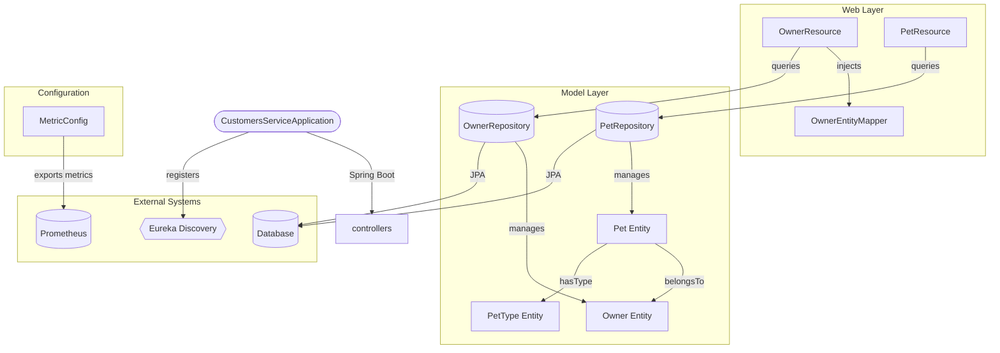

# Contributing Guidelines

Guidelines for contributing to the PetClinic Customers Service microservice.

The `petclinic-customers-service` is a Spring Boot microservice responsible for managing owners and pets within the Spring PetClinic application. It exposes REST APIs for owner and pet CRUD operations, persists data via JPA, and registers with Eureka for service discovery. Contributors should understand the domain model, REST layer, and testing conventions outlined below before submitting changes.



## Development

### Prerequisites

- **Java 17+** (Spring Boot parent POM determines the exact version)
- **Maven 3.x** for building and dependency management
- Access to a running **MySQL** instance (production) or **HSQLDB** (default for local/test)

### Project Structure

The source code is organized under the `org.springframework.samples.petclinic.customers` package:

```
src/main/java/org/springframework/samples/petclinic/customers/
├── CustomersServiceApplication.java   # Application entry point
├── config/
│   └── MetricConfig.java              # Micrometer metrics configuration
├── model/
│   ├── Owner.java                     # Owner JPA entity
│   ├── OwnerRepository.java           # Owner data access interface
│   ├── Pet.java                       # Pet JPA entity
│   ├── PetRepository.java             # Pet data access interface
│   └── PetType.java                   # PetType JPA entity
└── web/
    ├── OwnerResource.java             # Owner REST controller
    ├── OwnerRequest.java              # Owner request DTO
    ├── PetResource.java               # Pet REST controller
    ├── PetRequest.java                # Pet request DTO
    ├── PetDetails.java                # Pet API response record
    ├── ResourceNotFoundException.java  # Custom 404 exception
    └── mapper/
        ├── Mapper.java                # Generic mapper interface
        └── OwnerEntityMapper.java     # Owner request-to-entity mapper
```

### Building

```bash
# Build the project (skip tests)
mvn clean package -DskipTests

# Build with tests
mvn clean package
```

### Running Locally

```bash
# Run the application (uses HSQLDB by default for local dev)
mvn spring-boot:run
```

The service exposes its REST API on port **8081** (as configured in the Maven Docker profile). When running locally without infrastructure, HSQLDB provides an in-memory database.

### Key Dependencies

| Dependency | Purpose |
|---|---|
| `spring-boot-starter-data-jpa` | JPA/Hibernate data access |
| `spring-boot-starter-webmvc` | REST API layer |
| `spring-boot-starter-actuator` | Health checks and metrics endpoints |
| `spring-cloud-starter-netflix-eureka-client` | Service discovery registration |
| `spring-cloud-starter-config` | Externalized configuration |
| `spring-boot-starter-zipkin` | Distributed tracing |
| `mysql-connector-j` | MySQL JDBC driver (runtime) |
| `hsqldb` | In-memory database for dev/test |
| `micrometer-registry-prometheus` | Prometheus metrics export |

### Domain Model

The service manages three core entities:

- **`Owner`** — Represents a pet owner with fields for name, address, and telephone. Maintains a one-to-many relationship with `Pet`.
- **`Pet`** — Represents an individual pet with a name, birth date, type, and owner reference. Uses `@JsonIgnore` on the owner field to prevent circular serialization.
- **`PetType`** — A lookup entity for pet categories (e.g., cat, dog).

The `Owner.addPet()` method manages the bidirectional relationship between owners and pets.

```mermaid
sequenceDiagram
    %% Source: Context #5 (OwnerResource class)
    actor Client as HTTP Client
    participant OR as OwnerResource
    %% Source: Context #5 (OwnerEntityMapper class)
    participant OEM as OwnerEntityMapper
    %% Source: Context #5 (OwnerRepository interface)
    participant Repo as OwnerRepository
    %% Source: Context #5 (Owner entity class)
    participant DB as "Database/JPA"

    Note over Client,DB: Owner Management API Flow
    %% Source: Context #5 (OwnerResource.createOwner method)
    rect rgb(240, 248, 255)
        Note right of Client: POST /owners
        Client->>+OR: createOwner(OwnerRequest)
        OR->>+OEM: map(null, ownerRequest)
        OEM-->>-OR: Owner entity
        OR->>+Repo: save(owner)
        Repo->>DB: persist(Owner)
        DB-->>Repo: Saved
        Repo-->>-OR: Optional<Owner>
        OR-->>-Client: 201 Created
    end

    %% Source: Context #5 (OwnerResource.findAll method)
    rect rgb(245, 245, 245)
        Note right of Client: GET /owners
        Client->>+OR: findAll()
        OR->>+Repo: findAll()
        Repo->>DB: select * from owners
        DB-->>Repo: List<Owner>
        Repo-->>-OR: List<Owner>
        OR-->>-Client: 200 OK with list
    end

    %% Source: Context #5 (OwnerResource.findOwner method)
    rect rgb(255, 245, 238)
        Note right of Client: GET /owners/{ownerId}
        Client->>+OR: findOwner(ownerId)
        OR->>+Repo: findById(ownerId)
        Repo->>DB: select by id
        DB-->>Repo: Optional<Owner>
        Repo-->>-OR: Optional<Owner>
        OR-->>-Client: 200 OK or 404
    end

    %% Source: Context #5 (OwnerResource.updateOwner method)
    rect rgb(240, 255, 240)
        Note right of Client: PUT /owners/{ownerId}
        Client->>+OR: updateOwner(ownerId, ownerRequest)
        OR->>+Repo: findById(ownerId)
        Repo->>DB: select by id
        DB-->>Repo: Optional<Owner>
        Repo-->>-OR: existingOwner
        opt owner exists
            OR->>+OEM: map(existingOwner, ownerRequest)
            OEM-->>-OR: updatedOwner
            OR->>+Repo: save(updatedOwner)
            Repo->>DB: update
            DB-->>Repo: Saved
            Repo-->>-OR: Updated
            OR-->>-Client: 204 No Content
        else owner not found
            OR-->>-Client: 404 Not Found
        end
    end
```

```mermaid
sequenceDiagram
    autonumber
    participant Client as "HTTP Client"
    participant PR as "PetResource"
    participant PRepo as "PetRepository"
    participant ORepo as "OwnerRepository"

    %% Fetch Pet Types endpoint
    Client->>+PR: GET /petTypes
    PR->>+PRepo: findPetTypes()
    PRepo-->>-PR: List of PetType
    PR-->>-Client: 200 OK with PetType list

    %% Create Pet flow
    Client->>+PR: POST /owners/{ownerId}/pets
    PR->>+ORepo: findById(ownerId)
    alt Owner exists
        ORepo-->>-PR: Optional Owner found
        PR->>+PRepo: save(pet)
        PRepo-->>-PR: saved Pet
        PR-->>-Client: 201 Created with Pet
    else Owner not found
        ORepo-->>-PR: empty Optional
        PR-->>Client: 404 Not Found
    end

    %% Update Pet flow
    Client->>+PR: PUT /owners/*/pets/{petId}
    PR->>+PRepo: findById(petId)
    alt Pet exists
        PRepo-->>-PR: Optional Pet found
        PR->>+PRepo: save(pet)
        PRepo-->>-PR: saved Pet
        PR-->>-Client: 204 No Content
    else Pet not found
        PRepo-->>-PR: empty Optional
        PR-->>Client: 404 Not Found
    end

    %% Find Pet flow
    Client->>+PR: GET owners/*/pets/{petId}
    PR->>+PRepo: findById(petId)
    alt Pet exists
        PRepo-->>-PR: Optional Pet found
        PR-->>-Client: 200 OK with PetDetails
    else Pet not found
        PRepo-->>-PR: empty Optional
        PR-->>Client: 404 Not Found
    end
```

## Testing

### Running Tests

```bash
# Run all tests
mvn test

# Run a specific test class
mvn test -Dtest=PetResourceTest

# Run with coverage (requires JaCoCo plugin configuration)
mvn test jacoco:report
```

### Test Structure

Tests reside under `src/test/java/org/springframework/samples/petclinic/customers/`, mirroring the main source layout.

| Test File | Coverage |
|---|---|
| `web/PetResourceTest` | `PetResource` controller endpoints |

### Writing New Tests

- Tests use **JUnit 5** (`junit-jupiter-api` and `junit-jupiter-engine`).
- Assertions are written with **AssertJ** (`assertj-core`).
- Controller tests use **`spring-boot-starter-webmvc-test`** for mock MVC testing.
- Test classes are named `{ClassName}Test` and placed in the same package as the class under test.

```java
// Example test pattern for a REST controller
@WebMvcTest(PetResource.class)
class PetResourceTest {

    @Autowired
    private MockMvc mockMvc;

    @Test
    void shouldReturnPetTypes() throws Exception {
        mockMvc.perform(get("/petTypes"))
            .andExpect(status().isOk());
    }
}
```

When adding new endpoints or modifying existing ones, ensure corresponding test cases are added or updated.

## Contributing

### Workflow

1. Fork the repository and create a feature branch from `main`.
2. Make changes following the project conventions outlined below.
3. Run `mvn test` to verify all tests pass.
4. Submit a pull request with a clear description of the changes.

### Code Style

- Follow standard Java coding conventions.
- Use **4 spaces** for indentation (no tabs).
- Entity classes use JPA annotations at the class and field level.
- REST controllers are placed in the `web` package; request/response DTOs live alongside them.
- Entity-to-DTO mapping uses the `Mapper<TReq, TEntity>` interface pattern, with concrete implementations in the `web/mapper` package.

### Commit Messages

- Use clear, imperative commit messages (e.g., "Add pet type lookup endpoint").
- Reference related issues where applicable.
- Keep commits focused — one logical change per commit.

### Pull Request Guidelines

- PRs should target the `main` branch.
- Include context on **what** changed and **why** in the PR description.
- Ensure the build passes (`mvn clean package`) before requesting review.
- Add or update tests for any new functionality or bug fixes.

### Reporting Issues

Issues should be reported in the project's issue tracker with:
- A descriptive title
- Steps to reproduce (for bugs)
- Expected vs. actual behavior
- Environment details (Java version, OS, database)

For broader PetClinic microservices architecture questions, see the [Architecture documentation](ARCHITECTURE.md).