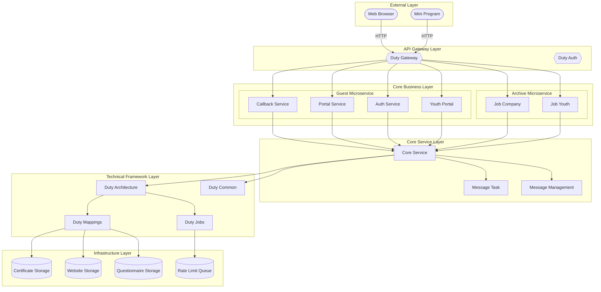
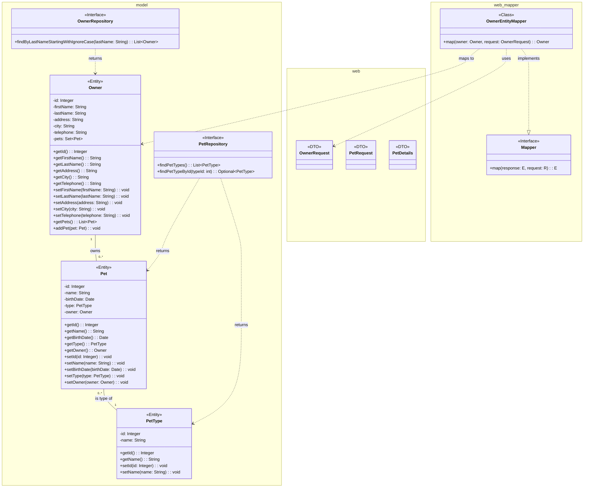
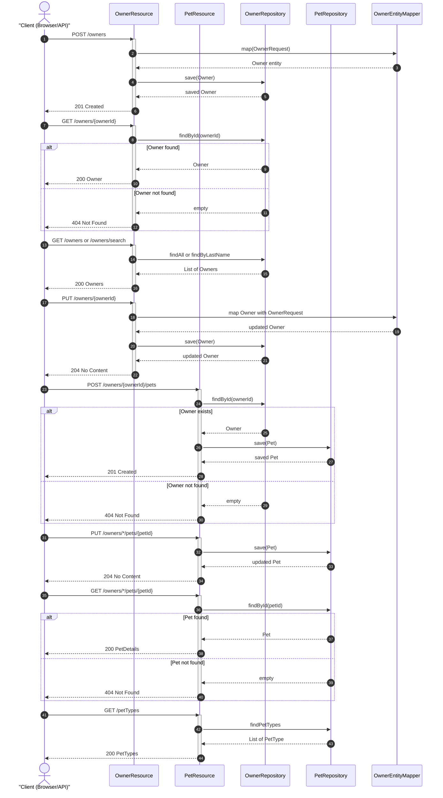

# Contributing Guidelines

Guidelines for contributing to the `petclinic-customers-service` module, a Spring Boot microservice providing REST APIs for managing Owner and Pet resources in the Spring PetClinic system.

## Overview

The `petclinic-customers-service` is a Java-based Spring Boot microservice that exposes REST endpoints for CRUD operations on Owner and Pet domain entities. It serves as the customer and pet management layer within the broader Spring PetClinic system, providing data transfer objects, domain models, exception handling, and observability metrics.

Contributions to this module should align with its existing architectural patterns: Spring Boot conventions, RESTful API design, DTO-to-entity mapping, and Micrometer-based metrics. The service uses Maven as its package manager, and all code must conform to the established Java style and test coverage expectations.

## Development

### Prerequisites

- Java (JDK) installed
- Maven (package manager) for dependency management and build commands
- An IDE that supports Java development (e.g., IntelliJ IDEA or Eclipse)

### Setting Up the Development Environment

Clone the repository and navigate to the project root:

```bash
git clone <repository-url>
cd petclinic-customers-service
```

Build the project using Maven:

```bash
mvn clean install
```

### Project Structure

```
├── pom.xml
└── src/
    ├── main/
    │   └── java/
    │       └── org/
    │           └── springframework/
    │               └── samples/
    │                   └── petclinic/
    │                       └── customers/
    │                           ├── config/
    │                           ├── model/
    │                           └── web/
    │                               └── mapper/
    └── test/
        └── java/
            └── org/
                └── springframework/
                    └── samples/
                        └── petclinic/
                            └── customers/
                                └── web/
```

- **Source code** is located under `src/main/java/org/springframework/samples/petclinic/customers/`.
- **Test code** is located under `src/test/java/org/springframework/samples/petclinic/customers/web/`.
- The module is built with **Maven**; no additional scripts or make targets are available.

### Key Architectural Components

| Component | Description |
|---|---|
| **OwnerResource** | REST controller exposing CRUD endpoints for Owner entities under `/owners`. |
| **PetResource** | REST controller handling pet-related HTTP endpoints for CRUD operations. |
| **PetType / Pet** | Entity classes defining pet domain models. |
| **OwnerRequest / PetRequest** | DTO records for incoming request validation. |
| **PetDetails** | View model record for API response representation. |
| **OwnerRepository / PetRepository** | Spring Data JPA repository interfaces for data access. |
| **ResourceNotFoundException** | Custom runtime exception class annotated to return HTTP 404 status. |
| **MetricConfig** | Configuration class for setting up Micrometer metrics with common tags and timed aspects. |

### Architecture Diagram

<!-- diagram_key: architecture_system_architecture -->


<!-- diagram_key: class_domain_model_and_dtos -->


<!-- diagram_key: sequence_owner_and_pet_crud_flows -->


### Code Style

- Follow standard Java coding conventions.
- Use Lombok or records where the existing codebase applies them (e.g., `OwnerRequest`, `PetRequest`, `PetDetails` are defined as records).
- Ensure REST controllers follow consistent naming and response patterns as established in `OwnerResource` and `PetResource`.

## Testing

### Running Tests

Execute all tests with Maven:

```bash
mvn test
```

### Test Location and Structure

- Tests reside under `src/test/java/org/springframework/samples/petclinic/customers/web/`.
- Test classes follow standard Java naming conventions with a `Test` suffix (e.g., `PetResourceTest`).
- Unit tests are used to validate REST endpoint behavior for resources such as Pets and Owners.

### Writing New Tests

- Place new test classes in the corresponding package under `src/test/java/org/springframework/samples/petclinic/customers/web/`.
- Follow existing test patterns: focus on endpoint validation and resource response correctness.
- Ensure that any new controller methods, exception handlers, or mapper logic are accompanied by unit tests.
- Tests should cover both happy-path and error scenarios (e.g., `ResourceNotFoundException` for missing resources).

### Code Quality

- No pre-commit hooks or linting tools are configured in this repository.
- Run `mvn test` before submitting changes to verify all tests pass.

## Contributing

Contributions are accepted via pull requests to the `petclinic-customers-service` repository.

### Workflow

1. **Fork** the repository.
2. **Create a branch** for your changes:

   ```bash
   git checkout -b feature/your-change
   ```

3. **Make your changes**, ensuring they follow the existing code style and include appropriate tests.
4. **Run all tests** to verify nothing is broken:

   ```bash
   mvn test
   ```

5. **Commit** your changes with clear, descriptive messages following the Conventional Commits format:

   ```
   feat: add endpoint for finding owners by last name
   fix: correct pet type serialization in response
   docs: update contributing guidelines
   ```

6. **Push** your branch and **open a pull request** against the main branch.

### Guidelines

- Keep pull requests focused on a single concern.
- Update or add tests alongside any new functionality or bug fixes.
- Ensure code compiles and passes all existing tests before submitting.
- When adding REST endpoints, follow the existing controller patterns in `OwnerResource` and `PetResource`.
- When modifying domain models (e.g., `Owner`, `Pet`, `PetType`), verify that all DTOs and mappers remain consistent.

### Reporting Issues

Issues should be reported via the repository's issue tracker. When reporting, include:

- A clear description of the problem or feature request.
- Steps to reproduce (for bugs).
- Relevant log output or error messages.