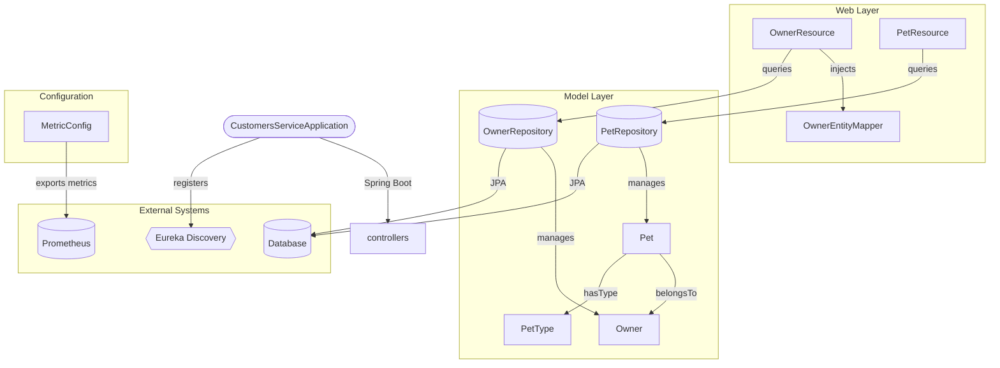

# PetClinic Customers Service


A Spring Boot microservice that manages owner and pet data for the PetClinic application. This service handles owner registration, pet management, and pet type lookups through a RESTful API, backed by JPA persistence with MySQL or HSQLDB.

## Overview

The PetClinic Customers Service is one of several microservices in the [PetClinic Microservices](https://github.com/spring-petclinic/spring-petclinic-microservices) architecture. It is responsible for the **Owner** and **Pet** domain models — creating, updating, retrieving owners, and managing the pets associated with those owners.

**Sibling services** in the ecosystem:

- `petclinic-api-gateway` — API gateway routing external traffic to internal services
- `petclinic-vets-service` — Manages veterinarian data and specialties
- `petclinic-visits-service` — Records and retrieves pet visit history

This service registers itself with **Netflix Eureka** for service discovery and supports **Spring Cloud Config** for centralized configuration. The following diagram illustrates the high-level architecture:



## Features

The service provides the following capabilities:

- **Owner CRUD Operations** — Create, retrieve, update, and list pet owners via REST endpoints
- **Pet Management** — Create and update pets, associate them with owners, and retrieve individual pet details
- **Pet Type Lookup** — Fetch available pet types (e.g., cat, dog) for reference data
- **JPA Persistence** — Entity classes with JPA mappings for Owner, Pet, and PetType backed by relational storage
- **Service Discovery** — Registers with Netflix Eureka for dynamic service location in the microservice fleet
- **Spring Cloud Config** — Externalized configuration support for multi-environment deployments
- **Observability** — Micrometer metrics with Prometheus registry, Spring Boot Actuator, and Zipkin tracing integration
- **Chaos Engineering** — Chaos Monkey support for resilience testing

## Requirements

- **Java** 17 or higher
- **Maven** 3.x
- **MySQL** 8.x (production) or **HSQLDB** (default/in-memory for local development)
- **Git** (for cloning the repository)

The service expects the parent POM `spring-petclinic-microservices` version 4.0.1. This is resolved automatically by Maven if the parent repository is accessible. With these prerequisites in place, you can proceed to install and run the service.

## Installation

```bash
# Clone the repository
git clone https://github.com/audoclyphia-evals/petclinic-customers-service.git
cd petclinic-customers-service

# Build the project
mvn clean package

# Skip tests during build (optional)
mvn clean package -DskipTests
```

To build the Docker image:

```bash
mvn package -PbuildDocker
```

## Quick Start

1. **Build the project:**

```bash
mvn clean package
```

2. **Run the service:**

```bash
java -jar target/spring-petclinic-customers-service.jar
```

The service starts on **port 8081** by default.

3. **Verify it is running:**

```bash
curl http://localhost:8081/owners
```

An empty list `[]` (or a list of existing owners) confirms the service is up.

## Usage

The following examples demonstrate how to interact with the primary API endpoints.

### Create an Owner

```bash
curl -X POST http://localhost:8081/owners \
  -H "Content-Type: application/json" \
  -d '{
    "firstName": "Jane",
    "lastName": "Doe",
    "address": "123 Main St",
    "city": "Portland",
    "telephone": "5035551234"
  }'
```

### Retrieve All Owners

```bash
curl http://localhost:8081/owners
```

### Retrieve an Owner by ID

```bash
curl http://localhost:8081/owners/1
```

### Update an Owner

```bash
curl -X PUT http://localhost:8081/owners/1 \
  -H "Content-Type: application/json" \
  -d '{
    "firstName": "Jane",
    "lastName": "Doe",
    "address": "456 Oak Ave",
    "city": "Portland",
    "telephone": "5035559999"
  }'
```

### Get Available Pet Types

```bash
curl http://localhost:8081/petTypes
```

### Create a Pet for an Owner

```bash
curl -X POST http://localhost:8081/owners/1/pets \
  -H "Content-Type: application/json" \
  -d '{
    "name": "Buddy",
    "birthDate": "2022-06-15",
    "typeId": 1
  }'
```

### Retrieve a Pet by ID

```bash
curl http://localhost:8081/owners/1/pets/1
```

### Update a Pet

```bash
curl -X PUT http://localhost:8081/owners/1/pets/1 \
  -H "Content-Type: application/json" \
  -d '{
    "id": 1,
    "name": "Buddy",
    "birthDate": "2022-06-15",
    "typeId": 2
  }'
```

## API Reference

For a comprehensive, machine-readable specification, the OpenAPI 3.0.3 document is provided below. This details all endpoints, parameters, and expected responses.

```yaml
openapi: 3.0.3
info:
  title: API Documentation
  description: Auto-generated API documentation
  version: 1.0.0
paths:
  /petTypes:
    get:
      summary: Retrieve all pet types
      description: Returns a list of all available pet types from the repository
      operationId: getPetTypes
      tags:
      - PetType
      responses:
        '200':
          description: Successful retrieval of pet types list
        '500':
          description: Internal server error
  /owners/{ownerId}/pets:
    post:
      summary: Create a new pet for an owner
      description: Creates a new pet record associated with the specified owner
      operationId: createPetForOwner
      tags:
      - Pets
      responses:
        '201':
          description: Pet created successfully
        '400':
          description: Invalid request
        '404':
          description: Owner not found
        '500':
          description: Internal server error
      parameters:
      - name: ownerId
        in: path
        required: true
        schema:
          type: integer
          minimum: 1
        description: Unique identifier of the owner
      requestBody:
        required: true
        content:
          application/json:
            schema:
              type: object
              required: []
              properties: {}
  /owners:
    post:
      summary: Create a new owner
      description: Creates a new owner entity from the provided request data and returns
        the created owner.
      operationId: createOwner
      tags:
      - Owner
      responses:
        '201':
          description: Owner created successfully
        '400':
          description: Bad request (validation error)
        '500':
          description: Internal server error
      requestBody:
        required: true
        content:
          application/json:
            schema:
              type: object
              properties:
                ownerRequest:
                  type: object
                  description: Owner creation request data
    get:
      summary: Retrieve all owners
      description: Returns a list of all owners in the system.
      operationId: getOwners
      tags:
      - Owner
      responses:
        '200':
          description: Success
  /owners/{ownerId}:
    get:
      summary: Retrieve a single owner by ID
      description: Fetches an owner record using their unique identifier.
      operationId: findOwner
      tags:
      - Owner
      responses:
        '200':
          description: Owner found successfully
        '404':
          description: Owner not found
        '400':
          description: Invalid owner ID provided
        '500':
          description: Internal server error
      parameters:
      - name: ownerId
        in: path
        required: true
        schema:
          type: integer
        description: Unique identifier of the owner, must be at least 1
    put:
      summary: Update an existing owner
      description: Updates owner details by ID using provided data
      operationId: updateOwner
      tags:
      - Owner
      responses:
        '204':
          description: Owner updated successfully
        '400':
          description: Invalid input or validation error
        '401':
          description: Unauthorized access
        '404':
          description: Owner not found
        '500':
          description: Internal server error
      parameters:
      - name: ownerId
        in: path
        required: true
        schema:
          type: integer
          minimum: 1
        description: Unique identifier of the owner
      requestBody:
        required: true
        content:
          application/json:
            schema:
              type: object
              description: Owner update data
  /owners/*/pets/{petId}:
    get:
      summary: Retrieve a pet by ID
      description: Retrieves a pet by ID and returns detailed information about the
        pet
      operationId: findPet
      tags:
      - Pets
      responses:
        '200':
          description: Success
        '400':
          description: Bad request
        '401':
          description: Unauthorized
        '500':
          description: Internal server error
      parameters:
      - name: petId
        in: path
        required: true
        schema:
          type: integer
        description: Pet identifier
    put:
      summary: Update an existing pet
      description: Updates pet details for a given pet ID using pet request body.
      operationId: updatePet
      tags:
      - Pets
      responses:
        '204':
          description: No Content
        '400':
          description: Bad request
        '404':
          description: Pet not found
        '500':
          description: Internal server error
      parameters:
      - name: petId
        in: path
        required: true
        schema:
          type: integer
        description: ID of the pet to update
      requestBody:
        required: true
        content:
          application/json:
            schema:
              type: object
              required:
              - id
              properties:
                id:
                  type: integer
                  description: Pet identifier
            example:
              id: 1
tags:
- name: Owner
- name: PetType
- name: Pets
```

## Additional Documentation

For more detailed information, see the following documentation:

- [PetClinic Customers Service Architecture](ARCHITECTURE.md) - Provides a high-level overview of the microservice's architecture, components, data flow, and integration points.
- [Contributing Guidelines](CONTRIBUTING.md) - Outlines development setup, coding standards, testing procedures, and guidelines for contributing to this Spring Boot microservice.