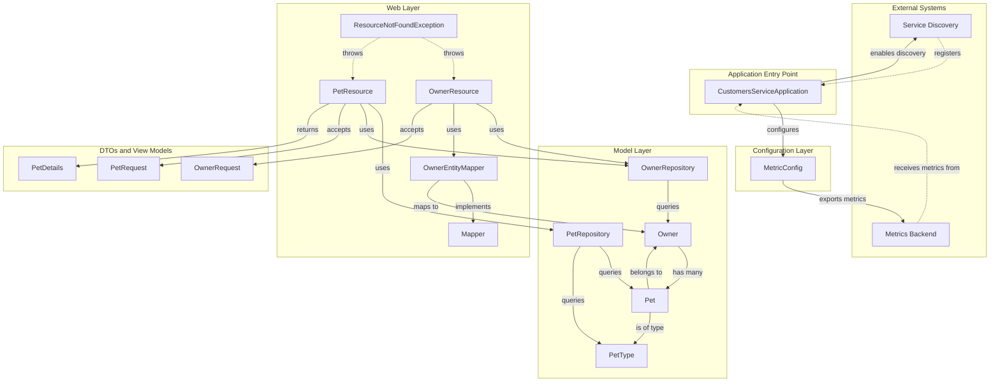

# PetClinic Customers Service


A Spring Boot microservice that manages owner and pet data for the PetClinic application. This service handles owner registration, pet management, and pet type lookups through a RESTful API, backed by JPA persistence with MySQL or HSQLDB.

The PetClinic Customers Service is one of several microservices in the PetClinic Microservices architecture. It is responsible for the **Owner** and **Pet** domain models — creating, updating, retrieving owners, and managing the pets associated with those owners.

This service registers itself with **Netflix Eureka** for service discovery. The following diagram illustrates the high-level architecture:



## 🎯 Features

- **Owner CRUD Operations** — Create, retrieve, update, and list pet owners via REST endpoints
- **Owner Search** — Search for owners by last name prefix (case-insensitive) via `GET /owners/search?lastName={query}`
- **Pet Management** — Create and update pets, associate them with owners, and retrieve individual pet details
- **Pet Type Lookup** — Fetch available pet types (e.g., cat, dog) for reference data
- **JPA Persistence** — Entity classes with JPA mappings for Owner, Pet, and PetType backed by relational storage
- **Service Discovery** — Registers with Netflix Eureka for dynamic service location
- **Observability** — Micrometer metrics with Prometheus registry, Spring Boot Actuator, and Zipkin tracing integration
- **Error Handling** — `ResourceNotFoundException` returns standardized HTTP 404 responses when owners or pets are not found
- **Unit Tests** — Test coverage for pet endpoint functionality via `PetResourceTest`

## 📋 Requirements

- **Java** 17 or higher
- **Maven** 3.x
- **MySQL** 8.x (production) or **HSQLDB** (default/in-memory for local development)

The service expects the parent POM `spring-petclinic-microservices` version 4.0.1. This is resolved automatically by Maven if the parent repository is accessible.

## ⚙️ Installation

```bash
# Clone the repository
git clone https://github.com/audoclyphia-evals/petclinic-customers-service.git
cd petclinic-customers-service

# Build the project
mvn clean package

# Skip tests during build (optional)
mvn clean package -DskipTests
```

To build the Docker image:

```bash
mvn package -PbuildDocker
```

## 🚀 Quick Start

1. **Build the project:**

```bash
mvn clean package
```

2. **Run the service:**

```bash
java -jar target/spring-petclinic-customers-service.jar
```

The service starts on **port 8081** by default.

3. **Verify it is running:**

```bash
curl http://localhost:8081/owners
```

An empty list `[]` (or a list of existing owners) confirms the service is up.

## 📖 Usage

The service exposes REST endpoints for Owner and Pet management. For a comprehensive, machine-readable API specification, see [api_documentation.yaml](api_documentation.yaml).

### Owner Endpoints

| Method | Path | Description |
|--------|------|-------------|
| `POST` | `/owners` | Create a new owner (returns `201 Created`) |
| `GET` | `/owners` | Retrieve all owners |
| `GET` | `/owners/search?lastName={query}` | Search owners by last name prefix (case-insensitive); returns all owners when blank |
| `GET` | `/owners/{ownerId}` | Retrieve a single owner by ID |
| `PUT` | `/owners/{ownerId}` | Update an existing owner (returns `204 No Content`) |

### Pet Endpoints

| Method | Path | Description |
|--------|------|-------------|
| `GET` | `/petTypes` | Retrieve all available pet types |
| `POST` | `/owners/{ownerId}/pets` | Create a new pet for an owner (returns `201 Created`) |
| `GET` | `/owners/*/pets/{petId}` | Retrieve a pet by ID |
| `PUT` | `/owners/*/pets/{petId}` | Update an existing pet (returns `204 No Content`) |

### Request/Response Notes

- Owner creation and update accept an `OwnerRequest` body with fields: `firstName`, `lastName`, `address`, `city`, `telephone`
- Pet creation and update accept a `PetRequest` body with fields: `id`, `name`, `birthDate`, `typeId`
- Pet retrieval returns a `PetDetails` record with pet information

### Example: Create an Owner

```bash
curl -X POST http://localhost:8081/owners \
  -H "Content-Type: application/json" \
  -d '{
    "firstName": "Jane",
    "lastName": "Doe",
    "address": "123 Main St",
    "city": "Portland",
    "telephone": "5035551234"
  }'
```

### Example: Retrieve All Owners

```bash
curl http://localhost:8081/owners
```

### Example: Search Owners by Last Name

```bash
# Search by last name prefix (case-insensitive)
curl http://localhost:8081/owners/search?lastName=Doe

# Omit or leave blank to return all owners
curl http://localhost:8081/owners/search
```

The search endpoint performs a case-insensitive prefix match on the `lastName` field. When the `lastName` parameter is blank or omitted, all owners are returned.

### Example: Update an Owner

```bash
curl -X PUT http://localhost:8081/owners/1 \
  -H "Content-Type: application/json" \
  -d '{
    "firstName": "Jane",
    "lastName": "Doe",
    "address": "456 Oak Ave",
    "city": "Portland",
    "telephone": "5035559999"
  }'
```

### Example: Get Available Pet Types

```bash
curl http://localhost:8081/petTypes
```

### Example: Create a Pet for an Owner

```bash
curl -X POST http://localhost:8081/owners/1/pets \
  -H "Content-Type: application/json" \
  -d '{
    "name": "Buddy",
    "birthDate": "2022-06-15",
    "typeId": 1
  }'
```

### Example: Retrieve a Pet by ID

```bash
curl http://localhost:8081/owners/1/pets/1
```

### Example: Update a Pet

```bash
curl -X PUT http://localhost:8081/owners/1/pets/1 \
  -H "Content-Type: application/json" \
  -d '{
    "id": 1,
    "name": "Buddy",
    "birthDate": "2022-06-15",
    "typeId": 2
  }'
```

### Error Responses

- **`404 Not Found`** — Returned by `ResourceNotFoundException` when a requested owner or pet does not exist. This custom runtime exception is annotated with `@ResponseStatus(HttpStatus.NOT_FOUND)` to ensure consistent 404 responses across all resource lookups.
- **`400 Bad Request`** — Returned for validation failures (e.g., `@Min(1)` on path variables, `@NotBlank` on required fields)

## 📚 Additional Documentation

For more detailed information, see the following documentation:

- [Contributing Guidelines](CONTRIBUTING.md) - Provides development setup instructions, testing guidelines, and coding standards for contributors, essential for collaborative development.
- [Architecture Overview](ARCHITECTURE.md) - Documents the system architecture, layer structure, key components, and integration points, offering detailed explanation complementing the architecture diagram.