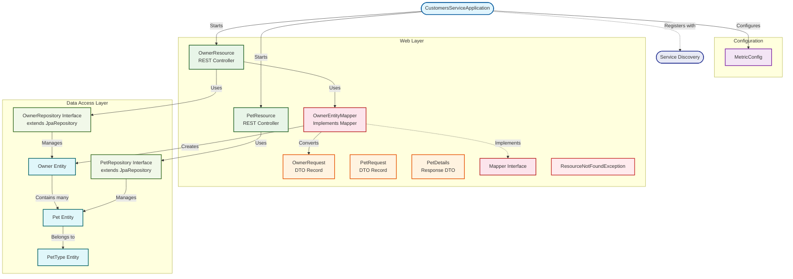
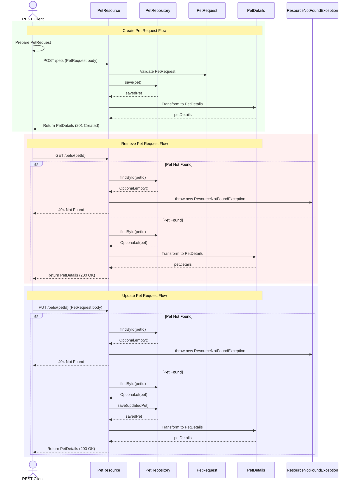
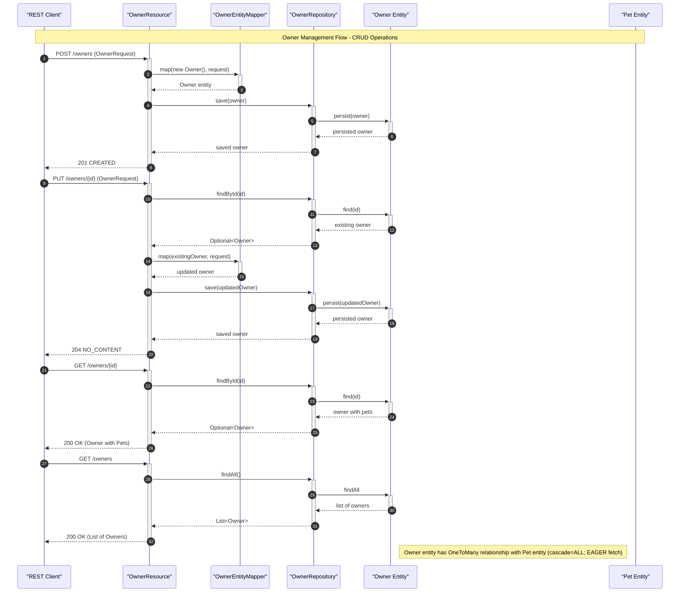

# petclinic-customers-service

A Spring Boot microservice managing customer and pet data for the PetClinic application.


This service provides REST API endpoints for managing owners and their pets, backed by JPA repositories and a relational database. It integrates with Netflix Eureka for service discovery and Spring Cloud Config for centralized configuration.

## Project Overview

This service is one component of the PetClinic microservices architecture, responsible for the customer domain — owners and their pets. It exposes RESTful endpoints consumed by the API gateway (`petclinic-api-gateway`).

The service is organized into three primary layers:

| Layer | Package | Responsibility |
|-------|---------|----------------|
| **Configuration** | `config` | Metrics and monitoring setup via Micrometer |
| **Domain Model** | `model` | JPA entities (`Owner`, `Pet`, `PetType`) and repository interfaces |
| **Web / API** | `web` | REST controllers, DTOs, mappers, and exception handling |

### Key Components

- **`CustomersServiceApplication`** — Spring Boot entry point with Eureka discovery client enabled
- **`OwnerResource`** — REST controller for Owner CRUD operations
- **`PetResource`** — REST controller for Pet management and pet type retrieval
- **`MetricConfig`** — Micrometer metrics configuration with common tags and timed aspects
- **`ResourceNotFoundException`** — Custom runtime exception returning HTTP 404



## Features

The service provides the following core capabilities:

- **Owner Management** — Create, read, and update owner records via REST endpoints at `/owners`
- **Pet Management** — Create, retrieve, and update pets associated with owners via `/owners/{ownerId}/pets`
- **Pet Type Catalog** — Retrieve available pet types via `/petTypes`
- **Request Validation** — Input validation using Jakarta Bean Validation annotations (`@NotBlank`, `@Digits`, `@Min`)
- **DTO Mapping** — Dedicated `OwnerEntityMapper` and generic `Mapper` interface for converting between request DTOs and entity objects
- **Standardized Error Handling** — `ResourceNotFoundException` ensures consistent HTTP 404 responses for missing resources
- **Metrics and Monitoring** — Micrometer integration with Prometheus registry, common application tags, and `@Timed` aspects on controllers
- **Service Discovery** — Eureka client registration for dynamic service lookup within the microservices cluster
- **Distributed Tracing** — Spring Boot Zipkin starter for request tracing across services

## Requirements

To run and develop this service, you will need:

- **Java 17** or higher (required by Jakarta EE namespace)
- **Apache Maven 3.9+** for building the project
- **Database** — MySQL (production) or HSQLDB (included as a runtime dependency for development)
- **Network access** to a Eureka service registry instance (for service discovery)
- **Network access** to a Spring Cloud Config server (for centralized configuration)

## Installation

### Prerequisites

Verify Java and Maven are installed:

```bash
java -version   # Should show Java 17+
mvn -version    # Should show Maven 3.9+
```

### Build the Service

Clone the repository and build:

```bash
git clone https://github.com/audoclyphia-evals/petclinic-customers-service.git
cd petclinic-customers-service
mvn clean install
```

### Build the Docker Image

A `buildDocker` Maven profile is available:

```bash
mvn package -PbuildDocker
```

The service exposes port **8081** by default (configured via `docker.image.exposed.port` in `pom.xml`).

## Quick Start

Once the service is built, you can run it quickly using the default in-memory database.

1. **Start the service:**

```bash
mvn spring-boot:run
```

2. **Verify the service is running:**

```bash
curl http://localhost:8081/owners
```

Expected output: an empty JSON array `[]` if no owners exist yet.

3. **Create an owner:**

```bash
curl -X POST http://localhost:8081/owners \
  -H "Content-Type: application/json" \
  -d '{
    "firstName": "Jane",
    "lastName": "Doe",
    "address": "123 Main St",
    "city": "Springfield",
    "telephone": "5551234567"
  }'
```

Expected output: the created owner object with an assigned `id`.

## Usage

With the service running, you can interact with the REST API endpoints. The following sections detail the available operations for owners and pets.

### Owner Endpoints

The `OwnerResource` controller (defined in the Project Overview) is mapped to `/owners` and provides the following operations:

| Method | Path | Description | Status |
|--------|------|-------------|--------|
| `POST` | `/owners` | Create a new owner | `201 Created` |
| `GET` | `/owners` | List all owners | `200 OK` |
| `GET` | `/owners/{ownerId}` | Retrieve a single owner by ID | `200 OK` |
| `PUT` | `/owners/{ownerId}` | Update an existing owner | `204 No Content` |

#### Create an Owner

```bash
curl -X POST http://localhost:8081/owners \
  -H "Content-Type: application/json" \
  -d '{
    "firstName": "John",
    "lastName": "Smith",
    "address": "456 Oak Ave",
    "city": "Portland",
    "telephone": "5559876543"
  }'
```

#### Retrieve All Owners

```bash
curl http://localhost:8081/owners
```

#### Retrieve a Specific Owner

```bash
curl http://localhost:8081/owners/1
```

#### Update an Owner

```bash
curl -X PUT http://localhost:8081/owners/1 \
  -H "Content-Type: application/json" \
  -d '{
    "firstName": "John",
    "lastName": "Smith",
    "address": "789 Pine Rd",
    "city": "Portland",
    "telephone": "5551112222"
  }'
```

If the owner is not found, the endpoint throws `ResourceNotFoundException` (defined in the Project Overview), which returns an HTTP 404 response.

### Pet Endpoints

The `PetResource` controller (defined in the Project Overview) provides pet management and pet type retrieval:

| Method | Path | Description | Status |
|--------|------|-------------|--------|
| `GET` | `/petTypes` | List all available pet types | `200 OK` |
| `POST` | `/owners/{ownerId}/pets` | Create a pet for an owner | `201 Created` |
| `GET` | `/owners/*/pets/{petId}` | Retrieve a specific pet's details | `200 OK` |
| `PUT` | `/owners/*/pets/{petId}` | Update a pet | `204 No Content` |

#### Retrieve Pet Types

```bash
curl http://localhost:8081/petTypes
```

#### Create a Pet for an Owner

```bash
curl -X POST http://localhost:8081/owners/1/pets \
  -H "Content-Type: application/json" \
  -d '{
    "name": "Buddy",
    "birthDate": "2023-06-15",
    "type": { "id": 1 }
  }'
```

If the specified owner does not exist, the endpoint throws `ResourceNotFoundException` (defined in the Project Overview) with an HTTP 404 response.

#### Retrieve Pet Details

```bash
curl http://localhost:8081/owners/*/pets/1
```

The response is a `PetDetails` record (defined in the Project Overview) containing the pet's information.

#### Update a Pet

```bash
curl -X PUT http://localhost:8081/owners/*/pets/1 \
  -H "Content-Type: application/json" \
  -d '{
    "id": 1,
    "name": "Buddy",
    "birthDate": "2023-06-15",
    "type": { "id": 2 }
  }'
```

The following sequence diagrams illustrate the flow of these operations:



