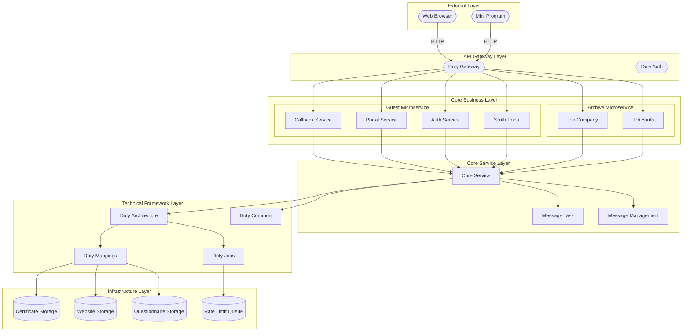
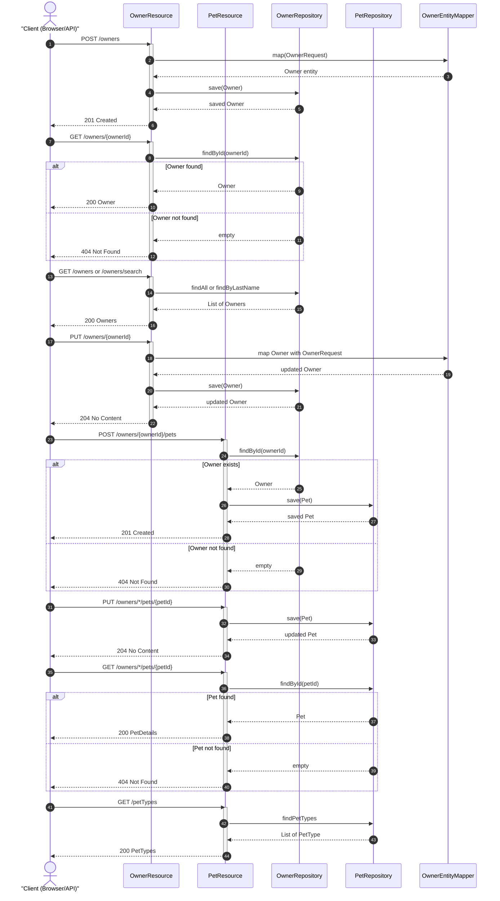

# petclinic-customers-service

REST API microservice for managing Owner and Pet resources in the Spring PetClinic application.


The `petclinic-customers-service` is a Spring Boot microservice that provides a REST API for managing customer (Owner) and pet data. It handles CRUD operations for Owner and Pet entities, exposes endpoints for querying pet types, and integrates with service discovery and distributed tracing. This service is part of the broader Spring PetClinic microservices architecture.

## Overview

This service provides the customer management layer of the Spring PetClinic application. It is responsible for:

- **Owner management** — Creating, reading, updating, and searching Owner records via REST endpoints under `/owners`.
- **Pet management** — Creating, updating, and retrieving Pet records associated with Owners, plus listing available PetTypes.
- **Data persistence** — Using Spring Data JPA with JPA repositories (`OwnerRepository`, `PetRepository`) to interact with the database.
- **Service discovery** — Registering with Netflix Eureka for service discovery in a microservices topology.
- **Observability** — Exposing Micrometer metrics and integrating with Zipkin for distributed tracing.

### Key Components

| Component | Purpose |
|-----------|---------|
| `OwnerResource` | REST controller for Owner CRUD operations |
| `PetResource` | REST controller for Pet CRUD operations |
| `Owner` | JPA entity representing a pet clinic owner |
| `Pet` / `PetType` | JPA entities for pets and pet types |
| `OwnerEntityMapper` | Maps `OwnerRequest` DTOs to `Owner` entities |
| `ResourceNotFoundException` | Custom exception returning HTTP 404 |
| `MetricConfig` | Micrometer metrics configuration |
| `CustomersServiceApplication` | Spring Boot application entry point |

<!-- diagram_key: architecture_system_architecture -->


## Features

- **Owner CRUD API** — Full create, read, update, and search operations for Owner resources via REST endpoints.
- **Pet CRUD API** — Create, update, and retrieve Pet records linked to specific Owners.
- **Pet Type Lookup** — Retrieve all available pet types for use in UI forms or validation.
- **Owner Search** — Case-insensitive search by last name prefix, with fallback to returning all owners when no filter is provided.
- **DTO Mapping** — Dedicated `OwnerRequest` and `PetRequest` DTOs for request validation, with `OwnerEntityMapper` for entity conversion.
- **Custom Exception Handling** — `ResourceNotFoundException` provides standardized HTTP 404 responses for missing resources.
- **Micrometer Metrics** — Performance monitoring with common tags and timed aspects via `MetricConfig`.
- **Service Discovery** — Eureka client integration for microservice registration and discovery.
- **Distributed Tracing** — Zipkin integration via Spring Boot starter for request tracing across services.

## Requirements

- **Java** — JDK 17 or higher (required by Spring Boot 3.x parent)
- **Maven** — 3.6+ for building the project
- **Database** — MySQL (production) or HSQLDB (development/testing)
- **Service Discovery** — Netflix Eureka (for microservice registration)
- **Configuration Server** — Spring Cloud Config (for externalized configuration)

### Optional Tools

- **Docker** — For containerized deployment (Dockerfile support via Maven profile)
- **Prometheus** — For metrics scraping (Micrometer Prometheus registry included)
- **Zipkin** — For distributed tracing visualization

## Installation

### Prerequisites

Ensure Java and Maven are installed:

```bash
java -version
mvn -version
```

### Build the Project

Clone the repository and build using Maven:

```bash
git clone <repository-url>
cd petclinic-customers-service

# Build the project (skip tests for quick build)
mvn clean install -DskipTests
```

### Run Locally

```bash
# Run with default profile (HSQLDB)
mvn spring-boot:run
```

The service exposes port `8081` by default (configured via `docker.image.exposed.port` in `pom.xml`).

### Build Docker Image

```bash
mvn clean install -PbuildDocker
```

## Quick Start

1. **Build the project:**

```bash
mvn clean install -DskipTests
```

2. **Start the service:**

```bash
mvn spring-boot:run
```

3. **Create an Owner:**

```bash
curl -X POST http://localhost:8081/owners \
  -H "Content-Type: application/json" \
  -d '{
    "firstName": "John",
    "lastName": "Doe",
    "address": "123 Main St",
    "city": "Springfield",
    "telephone": "1234567890"
  }'
```

Expected response: HTTP `201 Created` with the created Owner object (including generated `id`).

4. **Retrieve the Owner:**

```bash
curl http://localhost:8081/owners/1
```

Expected response: HTTP `200 OK` with the Owner JSON object.

## Usage

### Owner Endpoints

All Owner endpoints are served under the `/owners` base path.

#### Create an Owner

```bash
curl -X POST http://localhost:8081/owners \
  -H "Content-Type: application/json" \
  -d '{
    "firstName": "Jane",
    "lastName": "Smith",
    "address": "456 Oak Ave",
    "city": "Portland",
    "telephone": "0987654321"
  }'
```

Returns HTTP `201 Created` with the saved Owner entity.

#### Get an Owner by ID

```bash
curl http://localhost:8081/owners/1
```

Returns HTTP `200 OK` with the Owner object, or HTTP `404 Not Found` if the owner does not exist.

#### List All Owners

```bash
curl http://localhost:8081/owners
```

Returns HTTP `200 OK` with a JSON array of all Owner entities.

#### Search Owners by Last Name

```bash
# Search by last name prefix (case-insensitive)
curl "http://localhost:8081/owners/search?lastName=Smith"

# Without parameter — returns all owners
curl "http://localhost:8081/owners/search"
```

Returns HTTP `200 OK` with matching Owner entities.

#### Update an Owner

```bash
curl -X PUT http://localhost:8081/owners/1 \
  -H "Content-Type: application/json" \
  -d '{
    "firstName": "Jane",
    "lastName": "Smith-Jones",
    "address": "789 Pine Rd",
    "city": "Portland",
    "telephone": "0987654321"
  }'
```

Returns HTTP `204 No Content` on success, or HTTP `404 Not Found` if the owner does not exist.

### Pet Endpoints

#### Get All Pet Types

```bash
curl http://localhost:8081/petTypes
```

Returns HTTP `200 OK` with a list of all `PetType` entities.

#### Create a Pet for an Owner

```bash
curl -X POST http://localhost:8081/owners/1/pets \
  -H "Content-Type: application/json" \
  -d '{
    "name": "Buddy",
    "birthDate": "2023-01-15",
    "typeId": 1
  }'
```

Returns HTTP `201 Created` with the created Pet entity. Returns HTTP `404 Not Found` if the owner does not exist.

#### Get a Pet by ID

```bash
curl http://localhost:8081/owners/*/pets/1
```

Returns HTTP `200 OK` with a `PetDetails` object containing pet information.

#### Update a Pet

```bash
curl -X PUT http://localhost:8081/owners/*/pets/1 \
  -H "Content-Type: application/json" \
  -d '{
    "id": 1,
    "name": "Buddy",
    "birthDate": "2023-01-15",
    "typeId": 2
  }'
```

Returns HTTP `204 No Content` on success.

### Error Handling

When a resource is not found, the service returns HTTP `404 Not Found` via the `ResourceNotFoundException` class. For example, attempting to update a non-existent owner:

```bash
curl -X PUT http://localhost:8081/owners/999 \
  -H "Content-Type: application/json" \
  -d '{
    "firstName": "Test",
    "lastName": "User",
    "address": "123 St",
    "city": "City",
    "telephone": "1234567890"
  }'
```

Returns HTTP `404 Not Found` with an error message indicating the owner was not found.

<!-- diagram_key: sequence_owner_and_pet_crud_flows -->


## Additional Documentation

For more detailed information, see the following documentation:

- [Contributing Guidelines](CONTRIBUTING.md) - Provides development setup instructions, testing guidelines, and coding standards for contributors, essential for collaborative development.
- [Architecture Overview](ARCHITECTURE.md) - Documents the system architecture, layer structure, key components, and integration points, offering detailed explanation complementing the architecture diagram.

openapi: 3.0.3
info:
  title: API Documentation
  description: Auto-generated API documentation
  version: 1.0.0
paths:
  /petTypes:
    get:
      summary: HTTP endpoint to retrieve all pet types from the repository
      description: Retrieves a list of all available pet types from the pet repository.
      operationId: getPetTypes
      tags:
      - Pet Types
      responses:
        '200':
          description: Success
        '400':
          description: Bad request
        '401':
          description: Unauthorized
        '500':
          description: Internal server error
  /owners/search:
    get:
      summary: Search owners by last name prefix
      description: Returns owners filtered by last name prefix, or all owners if blank.
      operationId: searchOwners
      tags:
      - owners
      responses:
        '200':
          description: List of owners matching search criteria
        '400':
          description: Bad request
        '401':
          description: Unauthorized
        '500':
          description: Internal server error
      parameters:
      - name: lastName
        in: query
        required: false
        schema:
          type: string
        description: Last name prefix to search for
  /owners:
    post:
      summary: REST endpoint to create a new Owner
      description: Creates a new Owner resource with the provided details.
      operationId: createOwner
      tags:
      - Owner
      responses:
        '201':
          description: Owner created successfully
        '400':
          description: Invalid input data
        '401':
          description: Unauthorized
        '500':
          description: Internal server error
      requestBody:
        required: true
        content:
          application/json:
            schema:
              type: object
              required:
              - firstName
              - lastName
              - address
              - city
              - telephone
              properties:
                firstName:
                  type: string
                  description: First name of the owner
                lastName:
                  type: string
                  description: Last name of the owner
                address:
                  type: string
                  description: Address of the owner
                city:
                  type: string
                  description: City of the owner
                telephone:
                  type: string
                  description: Telephone number of the owner (max 12 digits)
            example:
              firstName: John
              lastName: Doe
              address: 123 Main St
              city: Anytown
              telephone: '1234567890'
    get:
      summary: REST endpoint to retrieve all Owners
      description: Documentation generation skipped due to LLM timeout (120s limit
        exceeded)
      operationId: ''
      tags: []
      responses:
        '200':
          description: Success
  /owners/{ownerId}:
    get:
      summary: Retrieve a single Owner by ID
      description: REST endpoint to retrieve a single Owner by ID
      operationId: findOwner
      tags:
      - Owner
      responses:
        '200':
          description: Success
        '400':
          description: Bad request
        '401':
          description: Unauthorized
        '500':
          description: Internal server error
      parameters:
      - name: ownerId
        in: path
        required: true
        schema:
          type: integer
        description: Owner identifier
    put:
      summary: Update an existing owner
      description: Updates an existing owner by ID with the provided owner details.
      operationId: updateOwner
      tags:
      - Owner
      responses:
        '204':
          description: Owner updated successfully
        '400':
          description: Invalid request body
        '404':
          description: Owner not found
        '500':
          description: Internal server error
      parameters:
      - name: ownerId
        in: path
        required: true
        schema:
          type: integer
          minimum: 1
        description: Unique identifier of the owner
      requestBody:
        required: true
        content:
          application/json:
            schema:
              type: object
              required:
              - firstName
              - lastName
              - address
              - city
              - telephone
              properties:
                firstName:
                  type: string
                  description: First name of the owner
                lastName:
                  type: string
                  description: Last name of the owner
                address:
                  type: string
                  description: Address of the owner
                city:
                  type: string
                  description: City of the owner
                telephone:
                  type: string
                  description: Telephone number of the owner
            example:
              firstName: John
              lastName: Doe
              address: 123 Main St
              city: Anytown
              telephone: 555-1234
  /owners/*/pets/{petId}:
    get:
      summary: Retrieve specific pet details by ID
      description: Retrieves details of a pet by its unique identifier. Throws ResourceNotFoundException
        if not found.
      operationId: findPet
      tags:
      - Pets
      responses:
        '200':
          description: Successful retrieval of pet details
        '400':
          description: Bad request due to invalid parameters
        '401':
          description: Unauthorized access
        '404':
          description: Pet not found
        '500':
          description: Internal server error
      parameters:
      - name: petId
        in: path
        required: true
        schema:
          type: integer
        description: Unique identifier of the pet
    put:
      summary: Update an existing pet's details
      description: Updates an existing pet's details with provided information.
      operationId: updatePet
      tags:
      - Pets
      responses:
        '204':
          description: Pet updated successfully
        '400':
          description: Bad request
        '401':
          description: Unauthorized
        '404':
          description: Pet not found
        '500':
          description: Internal server error
      parameters:
      - name: petId
        in: path
        required: true
        schema:
          type: integer
        description: Pet identifier
      requestBody:
        required: true
        content:
          application/json:
            schema:
              type: object
              required:
              - id
              - name
              - birthDate
              - typeId
              properties:
                id:
                  type: integer
                  description: Pet ID
                name:
                  type: string
                  description: Pet name
                birthDate:
                  type: string
                  description: Pet birth date in ISO format
                typeId:
                  type: integer
                  description: Pet type ID
            example:
              id: 1
              name: Fido
              birthDate: '2020-01-01'
              typeId: 1
  /owners/{ownerId}/pets:
    post:
      summary: Create a new pet for a specific owner
      description: Creates a new pet associated with the given owner ID. Returns the
        created pet.
      operationId: createPetForOwner
      tags:
      - Pets
      responses:
        '201':
          description: Pet created successfully
        '400':
          description: Bad request - invalid input
        '401':
          description: Unauthorized
        '500':
          description: Internal server error
      parameters:
      - name: ownerId
        in: path
        required: true
        schema:
          type: integer
        description: The ID of the owner to create the pet for
      requestBody:
        required: true
        content:
          application/json:
            schema:
              type: object
              required:
              - name
              - birthDate
              - typeId
              properties:
                name:
                  type: string
                  description: Name of the pet
                birthDate:
                  type: string
                  format: date
                  description: Birth date of the pet
                typeId:
                  type: integer
                  description: The ID of the pet type
tags:
- name: Owner
- name: Pet Types
- name: Pets
- name: owners